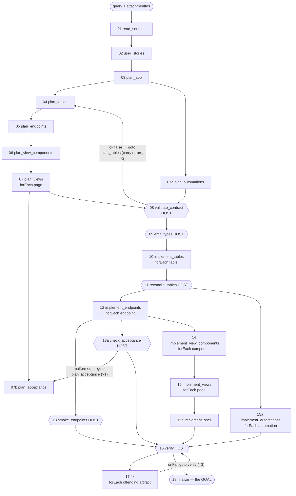

# APPFORMAT — what `system-appbuilder` is given, what it does, and what it leaves on disk

> **Format v2 is in.** The vocabulary is now **12 section kinds / 32 elements / 10 field kinds**,
> pages live in `views/`, `components/` and `shell.view.json` are top level, routes nest through
> `views/<prefix>/_layout.view.json`, and the assistant dock is renderer chrome the builder never
> authors. v1 projects are still read. The sections below marked *(v1)* describe the older layout;
> the target and the remaining plan are in [`APPFORMAT_IMPROVE.md`](./APPFORMAT_IMPROVE.md).

The one shipped app builder is the `system-appbuilder` space. It turns a **request plus attached
material** into a **live project-application**: a SQLite database, typed Node API handlers, a UI that
is *spec data* rather than TSX, an app shell, and optional automation — authored directly into the
project the session is already targeting and served at `/app/<projectId>/`.

Grounding: `libs/core/system-spaces/system-appbuilder/**`, `libs/cli/src/app/view-spec/schema.ts`,
`libs/cli/src/app/authoring/globals.ts`. Published docs:
[`org/docs/app/`](../../org/docs/app/README.md),
[`org/docs/format/project/`](../../org/docs/format/project/README.md),
[`org/docs/format/project/pages/view-spec.md`](../../org/docs/format/project/pages/view-spec.md).

---

## 1. Input

### 1.1 The call

| Entry | Shape |
|---|---|
| THING's app path | `delegate('system-appbuilder', 'automator', { query, attachmentIds })` — THING (the only holder of `project:manage`) first `createProject(name)`s or `selectProject(id)`s the target; the runtime retargets the delegate into it |
| The automator's default action | `defaultAction: build_live_project` (`agents/automator/instruct.md`) |
| The pipeline itself | `tasklist('build_live_project', { query, attachmentIds })` — declared input `query: string`, `attachmentIds: array` (`tasklists/build_live_project/index.md:1-6`) |

So the **input is exactly two things**: a natural-language request, and zero or more attachment ids
(documents, pasted text, spreadsheets, transcripts). Everything else — the tables, the endpoints,
the pages, the seeded rows — is derived. The automator never picks or creates the project; the
project is ambient state supplied by the host.

### 1.2 What the builder is allowed to touch

Authoring power is capability-granted; a grant that is absent is absent from both the injected
globals *and* the typecheck DTS, so an ungranted call is a typecheck error rather than a policy
violation (`libs/core/src/exec/app-globals.ts#injectAppGlobals`, `libs/core/src/typecheck/library-dts.ts`).

| Agent | Capabilities | Writers it can name |
|---|---|---|
| `automator` (the whole-app builder) | `db:schema` `db:read` `db:write` `api:write` `hooks:write` **`views:write`** | `writeProjectTable` `writeProjectApi` `writeProjectHook` `writeProjectEvent` `writeProjectFunction` `writeProjectView` `writeProjectViewComponent` `writeProjectViewShell` |
| `data-modeler` | `db:schema` `db:read` | `writeProjectTable` |
| `api-author` | `api:write` `db:read` | `writeProjectApi` |
| `spec-builder` | `views:write` `db:read` | the three spec writers |

**No agent in this space holds `pages:write`**, so `writeProjectPage` / `writeProjectComponent` (the
TSX writers) are neither injected nor in the DTS anywhere in this pipeline. Freehand React is
structurally unauthorable here — which is what makes every page renderable natively with no WebView.

There is also no generic filesystem: no `readFile`/`glob`/`grep`/`execShell`. Reads go through
`listProjectDir(dir)` (`.entries`), `readProjectFile(path)` (`.content`) and `readDocument(id)`
(`.text`); writes go only through the `writeProject*` writers, each of which is synchronous, validates
at save time, returns `{ ok, error? }`, and republishes so the change is live with no restart.

---

## 2. Output — the app format on disk

```
<root>/<projectId>/
├── project.json                     descriptor (id/name/title/icon)
├── package.json  tsconfig.json      build + typecheck config
├── database/<table>.json            table SCHEMAS  ← writeProjectTable
├── api/<path>/<METHOD>.ts           typed handlers ← writeProjectApi
├── pages/
│   ├── <route>.view.json            a PAGE, as a spec        ← writeProjectView
│   ├── <route>.tsx                  its GENERATED wrapper (never hand-edited)
│   ├── components/<Name>.view.json  a reusable shape          ← writeProjectViewComponent
│   └── _shell.view.json             nav + assistant dock      ← writeProjectViewShell
├── hooks/<slug>.ts                  cron / event automation   ← writeProjectHook
├── events/<name>.ts                 emitter defs (producers)  ← writeProjectEvent
├── functions/<name>.ts              reusable helpers          ← writeProjectFunction
├── spaces/<space>/…                 project-scoped agents
├── types/contract.d.ts              the PLAN's contract, emitted before implementation
└── (generated, git-ignored)  types/generated.d.ts · .data/app.db · .data/pages-dist/
```

Paths: `libs/cli/src/app/view-spec/files.ts#viewSpecPath`, `#viewWrapperPath`, `#viewComponentPath`,
`files.ts:44` (`_shell.view.json`); writers in `libs/cli/src/app/authoring/globals.ts#createProjectAuthoringGlobals`.

**The wrapper is the whole trick.** A spec sits beside a trivial generated `.tsx` that renders it
(`libs/cli/src/app/view-spec/wrapper.ts#renderViewWrapper`), so the page pipeline — discovery, content
hashing, caching, the route table, the client entry — never learns view specs exist. The wrapper
inlines the spec, the app's components and the shell for web; the native target fetches them instead.
A component or shell write therefore re-emits **every** wrapper.

### 2.1 `database/<table>.json`

```json
{
  "title": "Feed items",
  "description": "One personalized item in the user's feed.",
  "columns": {
    "id":        { "type": "string",  "description": "unique id", "primaryKey": true, "generated": "uuid" },
    "title":     { "type": "string",  "description": "headline", "required": true },
    "url":       { "type": "string",  "description": "source URL", "required": true, "unique": true },
    "score":     { "type": "number",  "description": "relevance rank", "default": 0 },
    "read":      { "type": "boolean", "description": "opened yet", "default": false },
    "createdAt": { "type": "date",    "description": "when it entered the feed", "generated": "now" }
  },
  "relations": {
    "comments": { "hasMany": "comments", "via": "feedItemId", "description": "notes attached" }
  }
}
```

- Column `type`: `string | number | boolean | date | json`. Exactly one `primaryKey: true`
  (`generated: 'uuid'`). `generated` is `uuid | now`.
- `references: { table, column?, onDelete? }` (`cascade | setNull | restrict`) is a real SQLite FK.
- Relations are `belongsTo` (this table holds the FK, `via` names its column) or `hasMany`.
- **Every table, column and relation needs a `description`** — validated fail-loud
  (`libs/core/src/db/validate.ts#validateTableSchema`).
- `writeProjectTable(name, schema, rows?)` — the third argument SEEDS rows at creation. It MERGES with
  an existing schema and can never drop a declared column
  (`libs/cli/src/app/authoring/globals.ts#mergeWithExistingTable`), because the live table cannot drop
  one either.

### 2.2 `api/<path>/<METHOD>.ts`

Route = the directory, HTTP method = the filename, `[id]` → `:id`.

```ts
export const name = 'items-list';                 // stable agent-facing id, unique per project
export const description = 'List all items, newest first.';
export interface Input {}
export interface Output { items: { id: string; title: string }[] }
export default async function handler(_input: Input, ctx: { db: any }): Promise<Output> {
  const items = await ctx.db.query('items', { orderBy: { column: 'createdAt', dir: 'desc' } });
  return { items };
}
```

`ctx.db` is the async data API (`query/insert/update/remove/tables`). `Input`/`Output` become the
endpoint's JSON-Schema contract, consumed four ways: ajv request validation, the agent's `apiCall`
overloads, `types/generated.d.ts`, and the browser's `name → { method, routePath }` manifest
(`libs/cli/src/app/build/contracts.ts#generateProjectContracts`). The only legal import is
`import { HttpError } from '@app/runtime'`.

### 2.3 `hooks/<slug>.ts`

Default-export a plain object with `type: 'cron' | 'event' | 'webhook'`, carrying **exactly one** of
`handler` / `trigger` (`libs/cli/src/app/hooks/loader.ts#validateHook`).

```ts
export default { type: 'cron', every: '30m', handler: async ({ db }) => { /* … */ } };
export default { type: 'event', on: { event: 'project/db.raw_items.insert' }, trigger: 'space/agent#action' };
```

`every` is `<n>m|h|d`, mutually exclusive with `daily: 'HH:MM'`. A db write auto-emits the synthetic
`project/db.<table>.<insert|update|remove>` event whose payload **is** the row
(`libs/cli/src/app/hooks/runtime.ts#ProjectHookRuntime.onDbWrite`) — that is how you react to a table
write. `writeProjectHook` validates the parse, the shape, that every column named in a
`db.insert`/`db.update` exists, and that an event's `project/db.<table>` table exists.

> ⚠️ **Known drift:** the space's own knowledge file still documents `{ type: 'database', on: { table, event } }`
> hooks (`system-appbuilder/knowledge/app_building/model/file-formats.md:107-124`). That kind was
> REMOVED with no back-compat: `writeProjectHook` will happily write the file (it does not run
> `validateHook`), and the loader then **drops it with a warning at load**
> (`libs/cli/src/app/hooks/loader.ts:238-243`, `#isRemovedDatabaseHook`) — a silently dead automation.
> The pipeline's own step prompt is correct and only emits `cron`/`event`
> (`tasklists/build_live_project/15a-implement_automations.md:22-40`); the knowledge aspect is the
> file to fix.

### 2.4 `pages/<route>.view.json` — a page is data

```ts
{
  route: 'items',
  title: 'Items',
  sections: [
    { kind: 'toolbar', id: 'tools', actions: [{ label: 'Add', icon: 'plus', reveals: ['add'] }] },
    { kind: 'create',  id: 'add', mutation: 'add-item', invalidates: ['items-list'] },
    { kind: 'list',    id: 'items', query: 'items-list', layout: 'rows',
      item: { title: '$.title', caption: '$.note', value: { value: '$.amount', format: 'currency' } },
      rowAction: { navigate: 'items/[id]', params: { id: '$.id' } },
      empty: { title: 'Nothing yet', message: 'Add one above.' } },
  ],
}
```

`route` is `index` or a path like `items/[id]`; the page shape is `{ route, title?, layout?, sections }`
and everything but `route`/`sections` is optional — every omission is a renderer default
(`libs/cli/src/app/view-spec/schema.ts#ViewSpec`). The minimum valid section is `{ kind: 'list', query: 'X' }`.

---

## 3. The component catalogue — everything a spec may use

Two closed vocabularies. There is no ninth section kind, no 25th element, no `custom`, and no code
escape hatch.

### 3.1 Section kinds (8) — `schema.ts#SECTION_KINDS`

| kind | for | fields |
|---|---|---|
| `list` | many records | `query` `from` `input` `param` `limit` `layout` `item` `facet` `sort` `search` `rowAction` `rowActions` `selectable` `bulkActions` `poll` `empty` |
| `detail` | one record | `query` `param` `input` `header` `fields` `body` `actions` `poll` `empty` |
| `create` | any form / write | `mutation` `input` `submitLabel` `invalidates` `async` `prefill` `onSuccess` — **never `fields`** |
| `stats` | a figures strip | `query` `input` `cards[{ label, value, delta?, icon?, meter?, action? } + format/tone]` `poll` |
| `markdown` | prose | `source` (literal) *or* `query` + `value`; `input` `poll` |
| `chat` | an assistant dock | `agent` `space?` `greeting?` `height?` (`sm|md|lg|full`) |
| `toolbar` | reveal/act buttons | `reveals` `actions` |
| `timeline` | a date-GROUPED stream | `query` `from` `input` `param` `group` `groupFormat` `limit` `item` `itemTime` `itemEndTime` `itemNote` `rowAction` `rowActions` `poll` `empty` |

Every section also takes `id` (the handle for `$data.<id>.…` and for a `reveals` target) and `title`
(`schema.ts#SectionBase`).

Notes that carry weight:

- **A `create` section declares no fields.** They derive from the mutation's `Input` JSON Schema —
  enums become selects, arrays of objects become repeating groups. `additionalProperties: false` turns
  an attempt to declare fields into a named validation error (`schema.ts#CreateSection`).
- **`facet` maps to a query input**, so filtering is honest about `limit`. `sort` is applied
  client-side over the limited page. `search` is sent as a query input when the endpoint declares
  `search`/`q`/`query`/`term`, otherwise filtered client-side over `search.fields`
  (`schema.ts#ListSection`).
- **`from`** sources rows from an array already embedded in an Output — `'$.citations'` (this
  section's own query) or `'$data.trip.days'` (another section's, in which case `query` is omitted and
  no request is made) (`schema.ts#From`).
- **`poll`** is a named policy, not a predicate: `{ everyMs, while: { field, in: [...] } }`. For a
  list/timeline it matches if ANY row matches (`schema.ts#Poll`).

### 3.2 Elements (24) — `schema.ts#ELEMENT_KINDS`

Every node is `{ el: '<kind>', …props }`.

| group | element | props |
|---|---|---|
| layout | `row` | `children` `gap` `justify` `align` `wrap` `scroll:'x'` |
| | `col` | `children` `gap` `align` |
| | `grid` | `children` `columns` `gap` `scroll:'x'` |
| | `spacer` | — |
| | `divider` | `label` |
| | `surface` | `children` `title` `action` + tone |
| typography | `heading` | `text` `level:1..4` |
| | `text` | `text` `bold` `dim` `italic` `strike` `maxLines` + format + tone |
| | `caption` | `text` `maxLines` + format + tone |
| | `markdown` | `text` |
| data display | `badge` | `text` `shape:'badge'\|'pill'\|'tag'` `icon` + tone |
| | `statcard` | `label` `value` `delta` `icon` `action` + format + tone |
| | `meter` | `value` `max` `label` `variant:'bar'\|'ring'\|'segments'` + tone |
| | `keyvalue` | `pairs[{ label, value } + format]` `layout:'stacked'\|'inline'` |
| | `table` | `rows` (binding) `columns[{ label, value, align? } + format]` `scroll:'x'` |
| | `timeline` | `items` (binding) `title` `time` `detail` `icon` + format |
| | `rating` | `value` `max` (read-only) |
| media | `image` | `src` `alt` `fit:'contain'\|'cover'` `ratio:'square'\|'wide'\|'tall'` |
| | `icon` | `name` `size:'sm'\|'md'\|'lg'` `tone` |
| feedback | `banner` | `text` `title` `icon` + tone |
| | `empty` | `title` `message` `icon` `action` |
| interaction | `button` | `label` `action` `reveals` `icon` `tone` `variant:'primary'\|'secondary'\|'ghost'` (needs `action` or `reveals`) |
| | `link` | `text` `to` (route) `params` `href` `external` `icon` |
| | `field` | `kind` `value` `mutation` `arg` `input` `label` `placeholder` `options` `min` `max` `step` `submitLabel` `invalidates` |

`field` is the only editable control and the reason a spec app can change a row at all: on change the
renderer calls `mutation` with `input` plus the new value under `arg` (default: the last segment of
`value`'s path). `kind` ∈ `toggle | rating | select | stepper | text` (`schema.ts#FIELD_KINDS`).

There is deliberately **no** `loading`, `spinner`, `skeleton` or `error` element — those states belong
to the renderer. `empty` is an override of a state that already exists, never the only way to have one.

**Repeater convention:** an element with an `items`/`rows` binding to an array opens a new `$` scope
for the value props evaluated per entry. Nothing else in the language creates scope.

### 3.3 The three ways to fill a slot — `schema.ts#Slot`

1. **Element tree** — `{ el: 'col', children: [ … ] }`.
2. **Component reference** — `{ use: 'RecipeCard', props: { recipe: '$' } }`.
3. **Flat item** (reach for this first) — a closed key set (`schema.ts#FlatItem`):
   `title` `subtitle` `caption` `meta` `value` `suffix` `note` `markdown` `badge` `status` `image`
   `icon` `badges` `keyvalue` `action` `actions`.
   Each of the value-ish keys takes a string **or** `{ value, suffix?, maxLines?, format?, currencyField?, tone?, toneMap?, toneOf? }`
   (`schema.ts#FlatValue`). An invented key is an `additionalProperties` error naming it.

### 3.4 Actions — `schema.ts#Action`

| form | meaning |
|---|---|
| `{ mutate, input?, over?:'selection', arg?, confirm?, invalidates?, onSuccess? }` | call a mutation by name; `onSuccess` may itself be any action (`$result.*` is in scope) |
| `{ navigate, params? }` | go to another page — the authoring route form (`trips/[tripId]`), never `/trips/:id` and never a spliced string |
| `{ download, input?, filename? }` | save an endpoint's Output to a file — an endpoint name, never a URL or a Blob |
| `{ print: true }` | print the current view |
| `{ copy }` | copy a bound value to the clipboard |

A labelled action (`schema.ts#ActionItem`) is `{ label, action?, reveals?, icon?, tone?, variant? }` and
must do at least one of `action` / `reveals`.

### 3.5 Bindings — eight roots, no expressions

`$` · `$.field` · `$props.x` · `$route.param` · `$data.<sectionId>.path` · `$result.field` ·
`$form.field` · `$client.timezone` (`schema.ts#BINDING_PATTERN`).

No conditionals, no arithmetic, no interpolation. `"$.price * $.qty"`, `"$.done ? 'a' : 'b'"` and
`"Total {{ n }}"` are all rejected, and rewriting them in another syntax will not help
(`schema.ts#looksLikeExpression`). **A binding that resolves to null renders nothing**, which is what
replaces every `x ? … : null` guard.

Computation therefore lives in exactly three places: renderer built-ins, a **named declarative policy**
(`format`, `toneMap`, `poll.while`, `merge: 'fill-empty'`), or the **endpoint's Output**.

An argument map (`input`, `mutate.input`, `navigate.params`, `link.params`, `prefill.input`,
`x-options.input`) takes an `Arg` — a binding **or** a scalar constant (`schema.ts#Arg`), so
`{ id: '$.id', meal: 'dinner', withinDays: 7 }` is one object and a number stays a number. That is what
lets one endpoint back three buttons.

### 3.6 The closed enums

| enum | values |
|---|---|
| `TONES` (7) | `neutral` `accent` `success` `warning` `danger` `info` `auto` — never a hex, an `rgb()` or a class name |
| `FORMATS` (8) | `currency` `date` `datetime` `time` `relative-time` `number` `percent` `humanize` |
| `ICON_NAMES` (32) | `home search plus edit trash check close chevron-right chevron-down arrow-left filter more refresh calendar clock user users tag file map-pin alert info star bell chart list link external-link download upload mail settings` |
| `LIST_LAYOUTS` (4) | `cards` `rows` `table` `grid` |
| `PAGE_ARCHETYPES` (6) | `dashboard` `list` `detail` `master-detail` `form` `stack` — normally **absent**; predicted from the section composition |
| `SHELL_PLACEMENTS` (4) | `auto` `tabs` `sidebar` `topbar` |
| `FIELD_KINDS` (5) | `toggle` `rating` `select` `stepper` `text` |

`toneMap: { '<value>': '<tone>' }` is the load-bearing half of colour: a lookup table, not a predicate,
which is how a third of a real app gets conditional colour without the language gaining conditionals.

### 3.7 Reusable components — configurable JSON — `pages/components/<Name>.view.json`

**Yes: an app's components are themselves configurable JSON files, not code.** A component is a named,
parameterised element tree with **declared props**, written by `writeProjectViewComponent(name, def)`
and persisted as `pages/components/<Name>.view.json`
(`libs/cli/src/app/view-spec/files.ts#viewComponentPath`). It is configured **per use site** by the
`props` object of a `{ use }` reference — the same JSON-in, JSON-out model as a page.

**The definition** (`schema.ts#ViewComponentSpec`, `schema.ts#VIEW_COMPONENT_SCHEMA`):

```json
{
  "name": "StatCard",
  "description": "A metric card — a centred label above a large formatted value.",
  "props": { "label": "string", "value": "string" },
  "node": {
    "el": "surface",
    "children": [{ "el": "col", "align": "center", "gap": 1, "children": [
      { "el": "caption", "text": "$props.label" },
      { "el": "heading", "text": "$props.value" }
    ]}]
  }
}
```

*(a real one, from `sdk/org/scenarios/30-bike-workshop/runs/101/data/.lmthing/bike-workshop/pages/components/StatCard.view.json`)*

**The configuration at each use site** (`schema.ts#ComponentRef`) — legal anywhere an element node is
(a `list.item`, a `detail.header`/`body`, a `children` entry of another component):

```json
{ "use": "StatCard", "props": { "label": "Bikes in shop", "value": "$.bike_count" } }
```

Each prop value is a `Value` — a **binding path or a literal string** — so one JSON component is
reconfigured per call site without any code. Node-valued props (passing a subtree as a prop) are not
in v1.

Rules the schema and the validator enforce:

| rule | where |
|---|---|
| `name` is **PascalCase** (`^[A-Z][A-Za-z0-9]*$`), `node` is required, no extra top-level keys | `schema.ts#VIEW_COMPONENT_SCHEMA` |
| `props` maps an identifier to a **type reference** — `'string'`, `'Recipe'`, `'Expense[]'` — typed against `@app/types` | `schema.ts#TYPEREF_PATTERN` |
| inside `node`, **`$props.<key>` is the only resolvable root** — a component has no endpoint of its own, so `$.field` there resolves against whatever scope the use site provides | `libs/cli/src/app/view-spec/validate.ts:904-910`, `:1236` |
| an **unknown prop** passed, or a **declared prop missing**, is a menu-shaped rejection naming the finite declared set | `validate.ts:983-989` (`#badProp`) |
| a `{ use }` naming a component that does not exist is rejected, listing every real component | `messages.ts#unknownComponent` |
| components may reference other components, **acyclically** — a cycle is a save-time error ("a component is data the renderer expands; a cycle expands forever") | `validate.ts#findComponentCycle`, `:1242-1249` |
| a component **nothing uses** is an app-wide *warning* from `validateAppViews`; a component **used once** is a modelling smell the step prompt forbids ("one use is worse than none") | `validate.ts#validateAppViews`, `agents/spec-builder/instruct.md` |
| a component write **re-emits every page wrapper**, because each wrapper inlines the app's components for the web bundle (native fetches them instead) | `files.ts#listViewRoutes`, `wrapper.ts#renderViewWrapper` |

Components are never React and can contain no imports, class names or colours — they compose the same
closed 24-element vocabulary as everything else, so a component is as native-renderable as a page.

> For completeness, two neighbouring things are *not* this and are worth not confusing with it:
> `<project>/components/<Name>.tsx` — React modules imported by **TSX** pages, the legacy medium no
> agent can author here — and a **space's** `components/view|form/<Name>.tsx`, which are chat-facing
> React components an agent renders with `display()`/`ask()`
> ([`org/docs/format/space/components/`](../../org/docs/format/space/components/README.md)). Only the
> `.view.json` kind above is part of the spec app's UI.

### 3.8 App shell — `pages/_shell.view.json`

`{ brand?, nav?, groups?, subnav?, placement?, assistant? }` (`schema.ts#ShellSpec`).

- `nav: [{ route, label?, icon?, badge? }]` — destinations must be **static** routes; a `[param]` route
  is a drill-in, never a nav item.
- Above **5** top-level static routes the renderer stops deriving nav and the model must declare
  `groups: [{ label, home, routes?, icon?, badge? }]` (`schema.ts#SHELL_DERIVE_MAX_ROUTES`). `home` is
  static; the `routes` highlight-family MAY be parameterised, because a drill-in belongs to its tab.
- `subnav: [{ match: 'trips/[tripId]', items | groups }]` — declared once per route family; the current
  route's parameters carry into every item. Without it, per-entity pages cannot reach each other.
- `badge: { query, field }` — a live count on a destination, declared as a data source (endpoint name +
  path) because the shell has no section scope to bind against.
- `assistant: { agent, space?, greeting? }` — the persistent chat dock, the `chat` section hoisted out
  of every page.

### 3.9 `x-options` — where a foreign-key form field's options come from

A `create` section declares no fields, so the option source lives on the **mutation's Input contract**
as a JSDoc JSON-Schema annotation (`schema.ts#XOptions`):

```ts
export interface Input {
  amount: number
  /** @x-options {"query":"listTravelers","label":"$.name","value":"$.id"} */
  paidByTravelerId: string
}
```

Without it a foreign-key field renders as a raw UUID text box.

### 3.10 When the vocabulary cannot express a surface

Say **which part** and **why**, and stop. There is no second builder to route to, so an honest "the
compare grid needs a multi-select that drives a query, and the spec language has no client state" is
the correct deliverable for that part; `finalize` carries it verbatim to the user as `cannotExpress`.
Forcing the surface into the nearest section kind is the single failure this builder is measured on.

---

## 4. The steps — input → output

`build_live_project` is a 23-node DAG: **CONTRACT → BUILD → PROVE**. Nothing is written before the
types it must satisfy exist, and every gate that matters is a HOST-RUN code node (it always executes,
never throws on a finding, and reports data rather than a verdict).



### 4.1 Node by node

| # | node | kind | what it does |
|---|---|---|---|
| 01 | `read_sources` | model, `role: explore` | a prelude `readDocument`s every attachment and `inspect`s it; returns a summary. This is the only node that sees the raw material |
| 02 | `user_stories` | model | distils request + material into the **stories** the app must satisfy |
| 03 | `plan_app` | model | the **binding** plan: `title`, `purpose`, `tables[]`, `endpoints[]`, `components[]`, `pages[]`. Owns *membership*; downstream planners only add detail, never add or drop an artifact. The page list stays lightweight (route + purpose) so no node holds every page's detail |
| 04 | `plan_tables` | model | columns with real TypeScript types |
| 05 | `plan_endpoints` | model | name, route, source tables and the **exact response fields with types** |
| 06 | `plan_view_components` | model | reusable shapes with typed props |
| 07 | `plan_views` | model, `forEach plan_app.pages` | per page: route, its sections, each section's kind + endpoint + `$.field` bindings. May emit `cannotExpress` |
| 07a | `plan_automations` | model | cron/event automations. Usually `[]`, and that is a complete build |
| 07b | `plan_acceptance` | model | machine-checkable checks against the seeded data: `rows-min`, `field-min`, `field-equals` — each `field-equals` carries its **worked-out expected value** |
| 08 | `validate_contract` | **HOST** | cross-checks the whole graph before a line of code exists: every table ref real, no duplicate name/route, every `[id]` route has a caller, no unread table, no dead endpoint, every automation grounded — **plus** every section's kind, endpoint, `$data.<id>`, `reveals` target and `{ use }` reference, and that **every section's full binding set is satisfiable by its ONE endpoint's declared Output**. On failure resumes `plan_tables` carrying `errors` (≤2) |
| 09 | `emit_types` | **HOST** | writes the validated contract to `types/contract.d.ts` (not `generated.d.ts`, which every build overwrites). Additive across runs — an endpoint the previous contract declared and this plan does not mention is carried forward verbatim |
| 10 | `implement_tables` | model, `forEach` | one `writeProjectTable(name, schema, rows)` per table, seeding source-derived rows |
| 11 | `reconcile_tables` | **HOST** | re-reads `database/*.json` (the writer MERGES, so plan and disk can legitimately diverge) and re-emits the contract from what actually landed. A **missing** table alone fails the node |
| 12 | `implement_endpoints` | model, `forEach` | one `writeProjectApi(route, src)` per endpoint |
| 13 | `smoke_endpoints` | **HOST** | the only node that ever CALLS an endpoint: valid synthesized input, every field wrong-typed, and for a `[param]` route both a missing param and the literal string `"undefined"` the client produces when a page forgets to pass one |
| 13a | `check_acceptance` | **HOST** | evaluates the acceptance checks against seeded data. Splits faults three ways: **code** faults (data exists, endpoint reports zero) → `fix`; **`dataGaps`** (the source was under-mined) → reported, not fixable by code; **`malformed`** (a check it could not evaluate) → resumes `plan_acceptance` once, then ships as *unproven* |
| 14 | `implement_view_components` | model, `forEach` | one `writeProjectViewComponent` object literal each |
| 15 | `implement_views` | model, `forEach` | one `writeProjectView` object literal per page |
| 15a | `implement_automations` | model, `forEach` | one `writeProjectHook` each; runs zero times when nothing was planned |
| 15b | `implement_shell` | model | `writeProjectViewShell` — nav/groups, per-entity subnav, the assistant dock |
| 16 | `verify` | **HOST** | merges three ground truths: the real `buildProjectApp()` typecheck + esbuild bundle; `validateAppViews()` (orphan route, dangling nav target, dead component, page with no data-bound section); `renderSmokeViews()` (every spec MOUNTED against live endpoint responses over seeded rows → render errors, binding coverage, **empty renders**). Folds in the `smoke_endpoints` and `check_acceptance` probes |
| 17 | `fix` | model, `forEach verify.offending` | one fork per offending artifact, reading that artifact's real errors plus the plan; `onFail: goto verify` (≤3), so verify→fix loops until clean |
| 18 | `finalize` | model, `goal: true` | reports honestly. Runs **no build of its own** — the last `verify` is authoritative |

### 4.2 The three rules the pipeline is built around

1. **One section, one endpoint, and the endpoint must return everything the section shows.** A
   cross-table name, a group-by total, a "which one is current" pick, a status label, a percentage, a
   boolean a control depends on — each is a **computed field on that endpoint**, because the page has
   no `.map`, no join and no ternary. `validate_contract` routes a miss to `plan_endpoints`, never to
   the page: the endpoint grows the field, the page never grows glue.
2. **Every toggle is a server-side flip.** The spec language has no `!`, so save/pin/dismiss/archive/
   mark-read must be an endpoint that flips the stored value when the new value is omitted. Planned any
   other way, every toggle in the app ships dead.
3. **An always-null binding is an ENDPOINT defect.** `verify` routes it to the handler's file. Pointing
   it at the view teaches the fixer to delete the binding — i.e. to delete the feature.

### 4.3 Every write is validated at save time, menu-shaped

```
sections[1].mutation: "addRecipies" is not an endpoint. Did you mean addRecipe?
Mutations: addRecipe, importRecipe, importRecipeText
```

The instance path, the offence, and the finite set of legal answers
(`libs/cli/src/app/view-spec/messages.ts`). The writer returns `{ ok, error? }` — never an array — so
the retry loop's whole job is to edit that **one** field and write again. Never resubmit the same
object; never delete the section to make the error go away.

Three validation tiers, all returning findings rather than verdicts
(`libs/cli/src/app/view-spec/validate.ts`): `validateViewSpec` at save time (shape via ajv first, then
every endpoint/field/component/route reference), `validateAppViews` app-wide, `renderSmokeViews`
against live data. A `navigate` target that is not yet a route is a **warning** at save time and an
**error** app-wide — because `recipes` and `recipes/[id]` link to each other and no write order
satisfies both.

### 4.4 The output envelope

`finalize` resolves (`tasklists/build_live_project/18-finalize.md:1-16`):

```ts
{
  ok, built,
  tables[], endpoints[], components[], pages[], automations[], routes[],
  missing[],        // failed pages/tables/automations + dataGaps + unproven checks
  cannotExpress[],  // { route, part, reason } — surfaces the vocabulary cannot express
  errors[],         // { file, phase, message }, including any gate that did not RUN
}
```

`ok` is true **only** when: the shell wrote, `verify.ok && verify.built` for all routes, **both** view
gates actually ran (`viewsValidated && renderSmoked`), at least one table and one page landed, and
nothing planned is missing. A gate that did not execute contributes no findings — which reads as
"clean" — so it is reported as a failure, never a pass. Nothing is ever stubbed or excluded to make it
pass.

The automator relays that envelope in **one statement**
(`currentTask.resolve(await tasklist('build_live_project', { query, attachmentIds }))`) and does not
add a second model turn — including when the envelope shows problems, because `finalize` already did
the diagnosis. If the envelope is lost, the only correct move is to resolve `{ ok: false }` saying so;
re-running restarts the whole build, and inventing an outcome has shipped a "the app is live" report
over an app with 11 typecheck errors and a 404.

---

## 5. What runs the result

`bootProjectApp(<root>/<projectId>)` restores (DR only), opens `.data/app.db` with WAL + foreign keys,
and reconciles `database/*.json` as the sole source of truth — additive `ALTER TABLE ADD COLUMN` for a
new column, **fail loud** on a drop/rename/PK move/type conflict (`libs/cli/src/app/boot.ts#bootProjectApp`).
Pages are esbuild-bundled per project into `.data/pages-dist/` and served at `/app/<projectId>/*`, with
`…/api/*` registered first so it never reaches the page catch-all
(`libs/cli/src/server/serve.ts`). Renderer improvements reach already-built apps through the
`BUILDER_VERSION` bump, because a spec app's UI lives in the renderer, not in its pages.

Full serving, CSP, auth-boundary and `@app/runtime` detail → [`org/docs/app/README.md`](../../org/docs/app/README.md).
