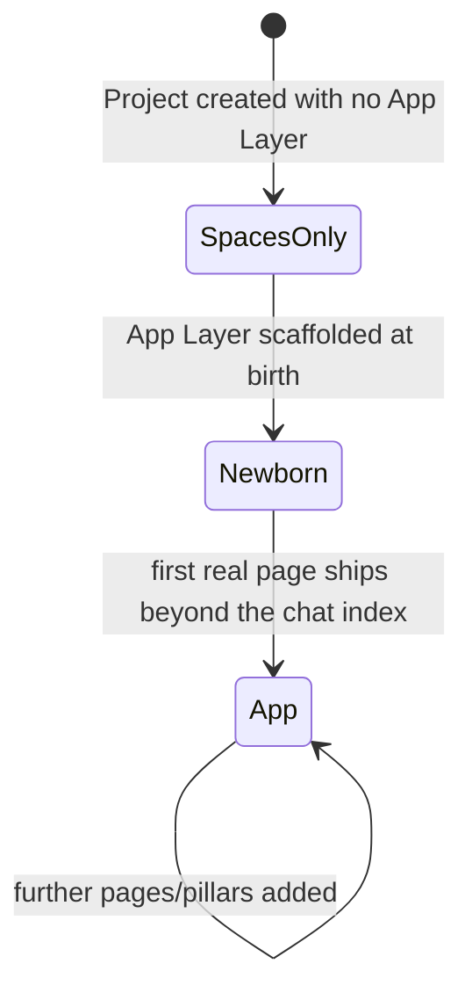

# The Agent App Platform Specification

### Spaces, Project-Apps, and App Morphing — a harness-agnostic interoperability spec

> **Status.** This document specifies a *format and protocol*, not an implementation. It is written so
> that a runtime other than the one it was extracted from — a different "harness" for driving
> LLM-backed agents — can implement a compatible plugin: read and write the same on-disk artifacts,
> enforce the same permission model, drive the same UI vocabulary, and reproduce the same project
> lifecycle. Where a fact is true only of the system this spec was distilled from, it is called out
> explicitly in a **Reference implementation** note and is non-normative — a conformant implementation
> is free to build that part however it likes.

---

## 1. Introduction

An **agent platform** in the sense of this document is a host that runs LLM-backed **agents**
against two kinds of authorable, on-disk artifact:

- a **Space** — a portable bundle of agent personas plus the deterministic tooling, workflows and
  reference material they draw on;
- a **Project** — a workspace that may grow an **App Layer**: a small full-stack application (data
  model, HTTP API, UI, background automation) that agents in the project author directly onto disk
  and the host serves live.

A project that has grown an App Layer is a **Project-App**. The transition of a project from having
no independently-reachable surface, to a single conversational surface, to a full multi-page
application — while never losing continuity of the conversation that drove it — is **App Morphing**,
specified in Part III.

This document has three parts:

- **Part I — The Space Format.** The directory shape of a Space, how an agent's identity and
  permissions are declared, and how it wires up to functions, knowledge, workflows, and events.
- **Part II — The Project-App Format.** The directory shape of a Project-App, its data/API/UI/
  automation pillars, and — in detail, because it is the most broadly reusable part of this spec — the
  **View Spec**, a closed declarative UI language designed to be renderable by more than one host.
- **Part III — App Morphing.** The lifecycle state machine a project moves through, and what a
  conformant harness must preserve across the transition.

Part IV is a self-certification checklist for an implementer. An appendix gives informative reference
shapes for the core JSON/TypeScript-ish document formats.

### 1.1 Conformance language

The key words **MUST**, **MUST NOT**, **SHOULD**, **SHOULD NOT**, and **MAY** are to be interpreted
as described in RFC 2119: MUST/MUST NOT are hard requirements for interoperability; SHOULD/SHOULD NOT
are strong recommendations that may be deviated from with good reason; MAY marks a genuine option.

### 1.2 Terminology

| Term | Meaning |
|---|---|
| **Host** | The runtime that loads Spaces and Projects, executes agent turns, and serves a Project-App's HTTP surface. |
| **Agent Runtime** | The isolated execution environment an agent's turn runs in — untrusted with respect to the host's own filesystem and network. |
| **Agent** | One named persona plus its configuration: which tools it may call, which other agents it may hand off to, and what it is permitted to author. |
| **Space** | A directory bundle of one or more Agents plus their supporting `functions/`, `knowledge/`, `tasklists/`, `components/`, `events/`, `hooks/`. |
| **Project** | A workspace identified by an id, optionally carrying an App Layer. |
| **App Layer / Project-App** | A Project's data model, API, UI and automation, authored as plain files under the Project root. |
| **Capability Grant** | A named permission an Agent declares; grants gate which host operations ("globals") are made available to that Agent's turns. |
| **Writer** | A host-provided, capability-gated operation that authors one on-disk artifact (a table schema, an API handler, a UI page, …) and validates it before it lands. |
| **View Spec** | A JSON document describing one page (or reusable fragment, or app shell) of a Project-App's UI, in a closed declarative vocabulary — never markup, never code. |
| **Renderer** | The component that turns a View Spec into an on-screen UI. A conformant Renderer may target any presentation technology. |
| **Morph** | The lifecycle transition of a Project from a bare conversational surface to a multi-surface application. |

### 1.3 What is in scope, and what is deliberately left open

In scope (normative): the on-disk directory shapes and file formats for a Space and a Project-App;
the Capability Grant model and its two-sided enforcement invariant; the View Spec vocabulary and its
validation obligations; the Project lifecycle state machine and its continuity requirements.

Explicitly **out of scope** — a conformant Host may implement these however it likes, and no part of
this spec should be read as constraining them: the agent sandboxing technology, the specific LLM
provider(s) and prompting strategy, the bundler/build pipeline for a UI Renderer, the storage engine
behind the data model (this spec assumes a relational store with the column types in §3.3, not a
specific database product), the process/thread model used for crash isolation, the network/transport
layer, and the deployment/hosting infrastructure.

> **Reference implementation.** This spec was distilled from **LMThing**: agent turns run in a
> QuickJS WASM sandbox; a Project-App's API handlers run in Node `worker_threads`; its data model is
> SQLite; its UI is served by a shared `ViewRenderer` that runs on a web bundle and natively on
> mobile; the whole stack is hosted by one long-running process called the **pod**. None of that is
> load-bearing for interoperability — it is cited only where a concrete example clarifies a rule.

---

# Part I — The Space Format

## 2. Overview

A Space is a directory tree of plain Markdown, JSON and TypeScript files:

```
<space>/
├── manifest (package.json)     # required only for a distributed Space — see §2.9
├── agents/                     # required (unless the Space is function-only)
│   └── <agent-slug>/
│       ├── charter.md          # fork-safe identity/guardrails — body only, no frontmatter
│       └── instruct.md         # frontmatter (config) + operating-instructions body
├── functions/                  # deterministic helpers callable by name — no LLM in the loop
│   └── <fnName>.ts
├── components/                 # agent-rendered chat UI
│   ├── view/<Name>.tsx         # display components (fire-and-forget)
│   └── form/<Name>.tsx         # interactive input components (blocking, returns a value)
├── tasklists/                  # DAG workflows an Agent action runs
│   └── <tasklist-slug>/
│       ├── index.md            # frontmatter (input schema, connections) + overview body
│       └── NN-<task-id>.md     # numbered steps, sorted lexically; NN-<id>.ts = a code node
├── knowledge/                  # structured, load-on-demand reference material
│   └── <domain>/<field>/
│       ├── index.md            # frontmatter (variable, type, default) + overview body
│       └── <aspect>.md         # one aspect per file — never a single catch-all doc
├── events/                     # typed emitter defs — makes the Space an event SOURCE
│   └── <name>.ts
└── hooks/                      # (optional) event consumers, { type: 'event' }
    └── <slug>.ts
```

A Space **MUST** contain an `agents/` directory with at least one Agent subdirectory, unless it is a
function-only Space explicitly loaded without that requirement (e.g. a library of shared functions
with no persona of its own). Every other directory is optional; a Space that has no need of a
directory simply omits it. A directory that is present but references something outside itself (an
Agent naming a function, knowledge ref, or tasklist that does not exist under the same Space) **MUST**
fail to load, loudly, rather than silently degrading — every cross-reference inside a Space is
resolved and validated at load time.

A Space **MUST** be self-contained and relocatable: nothing inside it may hard-code an absolute
filesystem path, a caller-specific id, or any other detail that would stop the same directory tree
from being copied into a different Project, or shipped through a catalog and installed by a different
user, and still working unmodified. This is what makes a Space a *unit of distribution*.

Two Spaces are structurally identical whether they are:

- **installed at the platform level** — available to every Project on the Host, typically the Host's
  own built-in specialists;
- **nested inside a Project** — a Project's own bundle of specialist Agents, at `<project>/spaces/…`,
  reusing exactly this format (see §3.9); or
- **distributed through a catalog** — a Space published for other users to discover and install, which
  is the one case where the manifest's descriptive block (§2.9) is actually read.

> **Reference implementation.** LMThing resolves Spaces from exactly two roots per Host instance — a
> **system** root shared across every Project, and a **project** root scoped to one Project — and
> materializes its shipped system Spaces into the system root on first boot.

A model-driven Agent **MUST NOT** be given a generic filesystem or shell inside a Space it is
authoring into. Every write to a Space's own files goes through typed, validating **Writer**
operations (one per artifact kind — an Agent file, a function file, a knowledge doc, a tasklist step,
an event def, a hook, the manifest), gated by capability exactly like a Project-App's writers (Part
II §3.10). Reads similarly go through a directory-listing and single-file-read operation scoped to the
Space's own root, never a generic `readFile`. This is what keeps a Space author's blast radius
confined to the Space it is actually working on.

## 3. Agents

Each Agent is a directory `agents/<agent-slug>/` holding up to two files.

### 3.1 `charter.md` — fork-safe identity

Plain Markdown prose, **no frontmatter**. It states who the Agent is, its voice, and hard guardrails
that must hold in *every* execution context the Agent ever runs in — including an isolated,
short-lived sub-task that has none of the Agent's other configuration. A Host **MUST** inject the
charter into every execution context that runs as this Agent, including isolated sub-tasks spawned to
do one narrow piece of work on the Agent's behalf, precisely because those contexts otherwise have no
identity at all. The charter file is optional; a missing one yields an empty identity block, not an
error.

Keep a charter short and free of orchestration instructions (which tools to call, when to delegate) —
an isolated sub-task cannot act on that prose anyway, since it does not carry the Agent's tool
configuration with it.

### 3.2 `instruct.md` — configuration + operating instructions

A `---`-delimited YAML frontmatter block, followed by a Markdown body. Malformed YAML **MUST** cause
a load-time failure rather than silently producing an empty configuration.

The body is the Agent's operating instructions — routing logic, tone, what to do in which situation —
injected into that Agent's own top-level and delegated turns, but **not** into isolated sub-tasks (see
§3.1): a sub-task has no ability to call the tools this prose assumes, so injecting it would only
confuse the smaller context.

The frontmatter is validated against a **fixed allow-list of keys**. A key outside that allow-list
**MUST** abort the entire Space's load, not just this Agent — the intent is that a typo in a
security-relevant key (a misspelled capability grant, a misspelled delegation list) fails loudly
instead of silently granting nothing. The recognized keys:

| Key | Type | Meaning |
|---|---|---|
| `title` | string | Display name. Defaults to the directory slug. |
| `knowledge` | string[] | Refs into this Space's `knowledge/` tree (§6). |
| `functions` | string[] | Refs into this Space's `functions/` (§4). |
| `components` | string[] | Refs into this Space's `components/view` or `components/form` (§5). |
| `actions` | object[] | Named entry points, each `{ id, label, description, tasklist? }` (§7). |
| `defaultAction` | string | An `actions[].id` this Agent runs, host-driven, on the first turn of a freeform session (§3.3). |
| `canDelegateTo` | string[] | The delegation allowlist (§3.4). |
| `dependencies` | string[] | Deprecated alias for `canDelegateTo`, read only when it is absent. |
| `capabilities` | (string \| object)[] | Project-App authoring/data grants (§4 of Part II, §8 of this Part). |
| `model` | string | Model alias/spec this Agent's turns run on; absent = inherit the caller's. |
| `triggers` | object[] | Inbound-webhook bindings for this Agent, `{ webhook: { path, provider? } }`. |

An Agent that declares neither `title` nor any of the above still loads — every key is optional except
that the file, if present, must parse.

### 3.3 `actions` and `defaultAction` — the host-driven fast path

Each `actions[]` entry names an entry point with an id, a label, a description, and — optionally — a
`tasklist` slug it runs. Every `actions[].tasklist` **MUST** resolve to a real tasklist under the same
Space's `tasklists/`, or the Space fails to load.

`defaultAction` names one such action. When a **new**, freeform session for this Agent starts (no
explicit action requested) and the named action has a `tasklist`, a conformant Host **SHOULD** run
that tasklist deterministically, host-driven, in place of the usual model-driven turn loop, and treat
its resolved output as the turn's result. This is a structured fast path, not a fallback: it exists so
an Agent whose whole job is "run this one workflow" does not need the model to decide to run it. It
applies only to how a session *starts* — every subsequent turn in that same session runs the ordinary
model-driven loop regardless of `defaultAction`.

### 3.4 `canDelegateTo` — delegation policy

Governs which other Agents this Agent's delegate/hand-off calls may target. The value is tri-state,
and the **default differs by declaration level**:

| Value | At Agent level | At a tasklist-step level (§7.4) |
|---|---|---|
| *(omitted)* | unrestricted (back-compat default) | none |
| `[]` | none — delegation is not offered to this Agent at all | none |
| `["*"]` | unrestricted — any target | unrestricted |
| explicit list | exactly those targets, enforced at call time | exactly those targets |
| `registered:*` | any Space registered dynamically at runtime; may combine with other entries | same |

A Host **MUST** enforce this policy at the moment of the delegate call, not merely as documentation:
a call outside the allowed set **MUST** fail with a message naming the actually-allowed targets, so a
model-driven caller can self-correct on its next turn. An Agent whose policy resolves to `none`
**MUST NOT** be offered a delegate operation at all — the same "not granted ⇒ not offered, and not
described to the model" invariant that governs Capability Grants (§8) applies here too.

## 4. Functions — deterministic helpers

`functions/<fnName>.ts` is a plain code module with no frontmatter and no model involvement: pure
logic (parsing, scoring, deduping, formatting) or a thin wrapper issuing one outbound call through a
capability-gated connection primitive. The exported name **MUST** match the file's basename. A
function is injected verbatim into an Agent's execution context, so it is ordinary code the Agent
calls synchronously — never an LLM turn of its own.

An Agent may call a function only if it is named in that Agent's `functions:` frontmatter list. A
tasklist step **MAY** further narrow the inherited set to a smaller allowlist for just that one step
(§7.4); an **empty** narrowed list **MUST** mean no functions at all for that step, not "inherit
everything."

## 5. Components — agent-rendered chat UI

`components/view/<Name>.tsx` and `components/form/<Name>.tsx` are single-file UI components an Agent
renders **into the conversation itself** — not part of a Project-App's served UI (that is the View
Spec, Part II §5). `view/` components are fire-and-forget display; `form/` components are interactive
and return a value back to the Agent's turn. A component reaches an Agent only if named in that
Agent's `components:` frontmatter, mirroring the `functions:` gate.

A conformant Host **MUST** refuse to render a dangerous descriptor kind (an embedded script, iframe,
frame, or arbitrary raw HTML injection) inside a form component, recursively through its children —
this is a chat-embedded surface, not a sandboxed page, and its trust boundary is the Host's
responsibility, not the authoring Agent's.

## 6. Knowledge — load-on-demand reference material

A two-level tree: `knowledge/<domain>/<field>/`, each field holding an `index.md` (frontmatter:
`variable`, `type`, `default`; body: an overview of what the field is *for* and how to choose among
its aspects) plus one Markdown file per **aspect** — a specific option under that field. An Agent
references a field or a specific aspect via a slash-joined ref (`domain/field` or
`domain/field/aspect`) in its `knowledge:` frontmatter; a ref that does not resolve **MUST** fail the
Space's load.

Two distinct surfacing behaviors, and a conformant Host **MUST** support both:

- a **two-part** ref (`domain/field`) is surfaced *on demand* — the Agent's context lists the field's
  overview and its available aspects by name, and the Agent explicitly loads one aspect's body when it
  needs it;
- a **three-part** ref (`domain/field/aspect`) is **preloaded** — that one aspect's body is resolved
  and injected up front, with its sibling aspects hidden from the Agent entirely.

A field's overview body **SHOULD** describe what each aspect is for in prose, and **SHOULD NOT**
hand-maintain a list of aspect filenames — a conformant Host supplies the real, current list of
on-disk aspect files automatically, so a hand-written list only goes stale.

## 7. Tasklists — DAG workflows

A tasklist is a directory `tasklists/<slug>/`: one `index.md` header (declaring an input schema and
any external connections the workflow needs) plus numbered step files `NN-<task-id>.md` (an
LLM-driven step) or `NN-<task-id>.ts` (a **code node** — deterministic host-run logic, no model turn).
Files are sorted lexically by their numeric prefix; that ordering fixes each step's default id and the
default goal (the last step, when none is explicitly marked), but it does **not** fix execution order.

### 7.1 Execution is a DAG, not a script

Each step declares `dependsOn: [<task-id>, …]`. A conformant Host **MUST** validate the whole graph
before running anything: every `dependsOn` reference resolves to a real step, there is no cycle, and
(when `forEach` is used) the fanned-over step is also a declared dependency. Ready steps — every
dependency resolved or explicitly skipped — **MUST** be free to run concurrently; nothing in this spec
requires or implies file order as execution order.

A downstream step reads an upstream step's resolved output, addressed by that upstream step's task id,
injected as a named value into the downstream step's own context. A step declaring
`forEach: "<taskId>.<field>"` fans out once per element of that array, running one instance per
element and collecting the results back into one array.

### 7.2 Step completion, salvage, and the result envelope

An LLM-driven step resolves by explicitly submitting its output against the step's declared output
schema; a submission that does not match the schema **MUST** fail that step rather than silently
passing through. A step marked `optional: true` that fails is skipped without sinking the whole run; a
non-optional failure **MUST** fail the run. The tasklist's overall result **MUST** distinguish three
outcomes, not collapse to a boolean: fully succeeded, succeeded with one or more steps salvaged/skipped
(**degraded**, but usable), and failed outright (the designated **goal** step itself could not resolve).
Collapsing "degraded" into either "ok" or "failed" loses information a caller needs — a caller that
gets back a degraded result and reports it as a clean success has hidden a real defect.

### 7.3 Opting in from an Agent

A tasklist is invoked only by an Agent declaring an `actions[]` entry naming it (§3.3) — never by a
free-floating name a model conjures. Loading **MUST** fail if an action names a tasklist that does not
exist under the same Space.

### 7.4 Per-step narrowing

A step **MAY** declare its own, narrower `capabilities:`/`functions:`/`canDelegateTo:` in its own
frontmatter. A conformant Host **MUST** treat this as a strict narrowing of what the parent Agent
already holds — the *intersection* of the step's request with the Agent's actual grants — never a
widening. A step attempting to grant itself something the parent Agent does not hold **MUST NOT**
receive it.

## 8. Events and Hooks — the unified event pipeline

This is one pipeline with two symmetric halves, and the **same file format applies whether it appears
in a Space or in a Project's App Layer** (Part II §3.7–3.8).

### 8.1 `events/<name>.ts` — the producer

Each file default-exports one typed emitter definition, discriminated by a `type` field, and declares
the payload shape of every event it can produce under an `emits` map:
`{ '<event.name>': { payload: { <field>: <typeString> } } }`. Event names **MUST** be dot-separated
lowercase segments; a scope (one Space, or one Project) **MUST** reject two defs declaring the same
event name.

Four producer kinds, and a conformant Host **MUST** support all four uniformly:

| Kind | Fires on | What its `emit` function receives |
|---|---|---|
| `webhook` | an external caller POSTs to the def's own bound path | the verified inbound request |
| `cron` | the def's own schedule (`every: <n><m\|h\|d>` or `daily: HH:MM`) | a time-tick context |
| `db` | a write lands on a declared table (`on: { table, event }`, `event ∈ insert\|update\|remove`) | the written row |
| `internal` | a curated Host lifecycle signal (`on: { signal }`) | the signal payload |

A `db` emitter is a **curated** producer — a conformant Host **MUST** already auto-emit a synthetic,
un-authored event of the form `<scope>/db.<table>.<insert|update|remove>` on every committed write,
whose payload *is* the written row, with no `db` def required. Author a `db` emitter only to expose a
domain-named event with a shaped payload instead of the raw row.

### 8.2 Event addressing

An emitted event **MUST** be source-qualified into `<sourceScope>/<event>` at dispatch, where
`sourceScope` is the literal scope identifier that produced it — the Project itself, or the id of the
Space that produced it. A consumer subscribes by this full address, never by the bare event name
alone, so two different scopes may legally emit `item.added` without colliding.

### 8.3 `hooks/<slug>.ts` — the consumer

Each file default-exports **exactly one** hook, carrying **exactly one** of a declarative `trigger`
(a `"space/agent#action"` reference — delegate straight to an Agent's action, no host code involved)
or an imperative `handler` (plain code, invoked with the event's payload; the handler *is* the filter —
it decides whether to react and simply returns early when it should not). Declaring both, or neither,
**MUST** fail validation.

Three kinds, discriminated by `type`, and every kind needs exactly one of `trigger`/`handler`:

| `type` | Subscribes to |
|---|---|
| `cron` | its own time schedule (independent of any emitter — a hook may itself be scheduled) |
| `event` | a source-qualified event address (§8.2) |
| `webhook` | an inbound HTTP path bound to this hook |

A hook **MAY** declare a `budget` (at minimum, a cap on how many episodes/turns and how much wall-clock
time a triggered Agent run may spend) — a conformant Host **MUST** forward it verbatim into any run the
hook kicks off, so an automation cannot silently spend unbounded resources.

### 8.4 Loop protection

A conformant Host **MUST** guard against runaway hook cascades: at minimum, a bounded recursion depth
on hook-triggered-hook chains, exclusion of a hook re-firing on an event its own run just produced, and
a short cooldown collapsing a burst of same-address events (most importantly db-write bursts) into one
fire rather than one per row. Without these, a hook that reacts to a table it also writes to can
trivially deadlock the Host in an infinite loop.

## 9. The manifest (`package.json`)

Required only for a **distributed** Space (one shipped through a catalog for other users to install);
a Space nested inside a single Project needs none at all, and a Host **MUST** load such a Space
successfully with no manifest present. Where present, a Host reads at minimum the package name and any
declared dependencies to install.

A distribution-specific block (named `lmthing` in the reference implementation; a conformant catalog
plugin **MAY** use its own key) carries: a `kind` discriminator (at minimum distinguishing an ordinary
Space from an *integration* Space — one whose primary purpose is to bridge to an external service), a
display `title`, `tags`, an `icon`, a one-line `description`, and — for an integration Space — a
JSON-Schema `settings` object describing the configuration/secret fields the Space needs, which a
conformant catalog UI **SHOULD** render as a form (masking any field whose schema marks it as a secret,
and never surfacing a configured secret's *value* back to any caller, only whether it is set).

---

# Part II — The Project-App Format

## 1. Overview

A Project is a workspace identified by an id. A Project **MAY** carry an **App Layer** — a small
full-stack application authored directly onto the Project's own directory tree:

```
<project>/
├── project.json                 # identity descriptor (id / title / icon)
├── manifest (package.json)      # npm-style metadata + UI dependencies
├── typecheck config (tsconfig)  # strict typecheck config for the authored tiers
├── database/<table>.json        # the DATA MODEL — one file per table
├── api/<path>/<METHOD>.ts       # the API — file-routed HTTP handlers
├── views/<route>.view.json      # the UI — one View Spec per page (see Part II §5)
│   └── <prefix>/_layout.view.json   # a nested layout frame, shared by every route under <prefix>
├── components/<Name>.view.json  # reusable View Spec fragments
├── shell.view.json              # the app shell — nav, brand, the always-on assistant dock
├── hooks/<slug>.ts              # in-process automation: cron | event | webhook
├── events/<name>.ts             # (optional) typed emitter defs — see Part I §8.1
├── spaces/<space>/…             # project-scoped Spaces — the app's own specialist Agents
└── (generated, never hand-authored) types/ · the compiled data store
```

`database/`, `api/`, `views/`+`components/`+`shell.view.json`, and `hooks/` are the **four pillars**.
`events/` and `spaces/` are optional siblings. Everything under a generated-artifacts directory
**MUST** be produced by the Host, never hand-authored, and **MUST** be safely regenerable from the
four pillars at any time.

A Project with none of the four pillars present is a **spaces-only Project** — legal, and **MUST**
load without error; a Host simply reports it as carrying no App Layer.

> **Reference implementation.** LMThing's current on-disk layout places the UI pillar at
> `views/<route>.view.json` with `components/<Name>.view.json` and `shell.view.json` at the Project
> root (its "format v2"); an earlier layout nested these one level under `pages/`. Both are cited here
> only to explain why worked examples elsewhere in the ecosystem may show either shape — a conformant
> new implementation should target the flatter, current layout shown above.

## 2. `project.json` — identity

A small descriptor: at minimum an `id`, a display `title`, and an `icon`. A conformant Host **MUST**
be able to derive a working identity even when this file is absent, by falling back to the directory
name and to identity fields on the manifest — but **MUST** synthesize a deterministic `project.json`
in that case rather than leaving identity ambiguous, so that re-deriving it twice produces the same
result (a non-deterministic synthesized identity would make every re-install of the same template look
like a diverged copy).

## 3. `database/<table>.json` — the data model

One file per table, named by its basename (the table name is **not** repeated inside the file).

```json
{
  "title": "Articles",
  "description": "A synthesized, personalized news article shown in the user's feed.",
  "columns": {
    "id":        { "type": "string",  "description": "unique id", "primaryKey": true, "generated": "uuid" },
    "title":     { "type": "string",  "description": "headline shown in the feed", "required": true },
    "score":     { "type": "number",  "description": "relevance rank; higher = surfaced first", "default": 0 },
    "read":      { "type": "boolean", "description": "whether the user has opened it", "default": false },
    "tags":      { "type": "json",    "description": "topic tag strings" },
    "createdAt": { "type": "date",    "description": "when the article entered the feed", "generated": "now" }
  },
  "relations": {
    "citations": { "hasMany": "citations", "via": "articleId", "description": "raw items this article was built from" }
  }
}
```

- A schema **MUST** carry a non-blank `description` at the table level and on **every** column — a
  conformant Host **MUST** reject a schema missing one, fail-loud, at write time. This is deliberate:
  the schema doubles as the app's documented mental model of its own data, read by both agents and
  humans, not merely its storage shape.
- Column `type` **MUST** be one of `string | number | boolean | date | json`. Exactly **one** column
  per table **MUST** set `primaryKey: true`. `generated` (`uuid` or `now`) auto-fills a value at
  insert time when the caller supplies none. `required` and `unique` are ordinary constraints. `enum`
  declares a **closed** value domain for a string column — advisory to the storage layer, but a
  conformant type-generation step (§3, "drives generated types" below) **SHOULD** render it as a
  string-literal union on the generated row type, so that comparing the column against a value outside
  its declared domain is a compile-time error, not a runtime surprise.
- `references: { table, column?, onDelete? }` declares a real foreign key; `onDelete` is one of
  `cascade | setNull | restrict`.
- A `relations` entry is either `belongsTo` (this table holds the foreign key; `via` names that
  column) or `hasMany` (the *target* table holds the foreign key back; `via` names it there) — both
  require a `description`.
- **Writing MUST be additive-merge, never destructive.** A write to an existing table's schema merges
  with what is already declared and **MUST NOT** silently drop a column the live table already has —
  the live table cannot drop one either without an explicit, deliberate migration path, which is
  out of scope for the ordinary authoring writer.
- A conformant Host **MUST** compile the table set into typed row shapes consumable by both the API
  tier and the UI tier (§4, §5) — one generated type per table, a required-or-primary-key column
  rendered non-optional and every other column optional, each field documented from its
  `description`, and each declared relation rendered as a typed, optional field (`hasMany` → an array
  of the target type, `belongsTo` → the target type).
- **Every committed write MUST auto-emit a synthetic event** of the form
  `<project>/db.<table>.<insert|update|remove>` whose payload is the written row (Part I §8.1) — a
  consumer never needs a dedicated emitter def merely to react to a write.

## 4. `api/<path>/<METHOD>.ts` — the API

File-routed HTTP handlers: **the endpoint's route is the directory path, and the HTTP method is the
filename** (`GET`/`POST`/`PUT`/`PATCH`/`DELETE`). A bracketed directory segment (`[id]`) is a dynamic
path parameter. Any other file in a route directory is ignored by routing.

```ts
import { HttpError } from '<the app runtime module>';

export const name = 'getArticle';                  // stable, project-unique, agent-facing id
export const description = 'Get a single article by id, including its citations.';

export interface Input { id: string }               // → the request's JSON Schema contract
export type Output = Article;                       // → the response's JSON Schema contract

export default async function handler(input: Input, ctx: Ctx): Promise<Output> {
  const rows = await ctx.db.query('articles', { where: { id: input.id }, include: ['citations'] });
  const article = rows[0];
  if (!article) throw new HttpError(404, 'article not found');
  return article;
}
```

- `name` **MUST** be unique across the whole Project and **MUST** be readable without evaluating the
  module (a static parse of the source) — the endpoint's route may change, but its stable `name` is
  what a UI or an Agent addresses it by.
- `Input`/`Output` **MUST** be compiled into JSON Schema and used for (at minimum) four purposes from
  one source of truth: request validation, an Agent-facing typed call surface, generated client types,
  and a name→route manifest for whatever client consumes the endpoint by name (§5's View Spec calls
  every endpoint by `name`, never by URL).
- **`Input` is one assembled object**, not declared per transport location: for a read method
  (`GET`/`DELETE`) the non-path fields come from the query string; for a write method
  (`POST`/`PATCH`/`PUT`) they come from the JSON body; path parameters always merge on top and win on
  any key clash.
- **One error shape.** A handler signals a specific HTTP status by throwing a typed error carrying
  `{ status, message, details? }`; any other thrown value **MUST** become a generic `500` whose real
  detail is logged host-side and **never** leaked in the response body.
- A handler's declared `Input`/`Output` **MUST NOT** be `any` (or implicitly typed as such), and its
  actual return value **SHOULD** be checked structurally against its declared `Output` at write time —
  an `any`-typed handler technically satisfies any consumer's expectations while returning whatever it
  wants, silently breaking every caller downstream. A conformant Host's authoring writer **SHOULD**
  reject such a handler at write time rather than let the mismatch surface later as an empty UI over
  real data.
- A field the UI tier will iterate as a list, or index into by sub-field, **SHOULD** be typed
  structurally (a named row-shaped interface), never as a pre-formatted display string the UI is
  expected to re-parse.

## 5. The View Spec — a closed declarative UI language

This is the part of the format most worth treating as a portable standard on its own: it contains no
markup and no code, so a spec written against it can be rendered by more than one Renderer, targeting
more than one presentation technology, with no change to the spec itself.

### 5.1 Files on disk

| Path | What |
|---|---|
| `views/<route>.view.json` | one page |
| `views/<prefix>/_layout.view.json` | a nested layout frame shared by every route under `<prefix>` |
| `components/<Name>.view.json` | a reusable, parameterised element composition |
| `shell.view.json` | the app shell — brand, navigation, the assistant dock |

A View Spec **MUST NOT** be compiled to code. A conformant Host serves the raw spec documents (over
whatever transport it chooses) and a Renderer fetches and renders them directly; writing one artifact
lands exactly that one artifact — there is no secondary build step a write must also trigger.

### 5.2 The shape of a page

A page is `{ route, title?, layout?, sections }`. Everything but `route` and `sections` is optional,
and **every omission MUST resolve to a Renderer default, never to a gap** — the minimum legal page is
one section: `{ kind: 'list', query: '<endpoint-name>' }`.

`route` is either `index` or a path using the same bracket syntax as the API tier for a dynamic
segment (`recipes/[id]`).

### 5.3 Section kinds — a closed, capped vocabulary

A conformant implementation **MUST** implement exactly this set of section kinds and **MUST NOT**
invent an additional one, a `custom` escape hatch, or any form of embedded code/markup as a way to
express something the vocabulary cannot. When a desired surface genuinely cannot be expressed in this
vocabulary, the correct behavior is to **report that fact explicitly** (naming which part, and why)
rather than force the nearest section kind to approximate it — approximating loses the information
that the vocabulary needs to grow, and produces a worse UI besides.

| Kind | For | Notable fields |
|---|---|---|
| `list` | a collection | `query`, `from`, `item`, `facet`, `sort`, `search`, `rowAction(s)`, `selectable`+`bulkActions`, `poll`, `empty` |
| `detail` | one record | `query`, `header`, `fields`, `body`, `actions`, `poll`, `empty` |
| `create` | a form | `mutation`, `submitLabel`, `invalidates`, `async`, `prefill`, `onSuccess` — **declares no fields** |
| `stats` | a metrics strip | `query`, `cards[]` (label/value/delta/icon/meter) |
| `markdown` | prose | `source` (literal) or `query`+`value` (bound) |
| `chat` | an embedded assistant | `agent`, `space?`, `greeting?`, `height?`, `suggestions?` |
| `toolbar` | mode toggles / actions | `reveals`, `actions` |
| `timeline` | a date-grouped, time-ordered stream | `query`/`from`, `group`, `groupFormat`, `itemTime`, `itemNote` |
| `board` | rows bucketed into columns by one field | `group`, `columns` |
| `calendar` | a month grid of rows | `date`, `month` |
| `chart` | plots over one endpoint's rows | `charts[]` (`bar\|line\|area\|donut`, `x`, `y`, `series?`) |
| `outlet` | where a child route renders | legal only inside a layout (§5.9), exactly once |

Every section carries an optional `id` (the handle other sections and `reveals` targets address it
by) and an optional `title`.

**The `create` section declares no fields.** A form's fields are derived entirely from the target
mutation's own `Input` contract — an enum becomes a select, an array of objects becomes a repeating
group. This is deliberate, not a limitation: it means a form can never drift out of sync with the
endpoint it submits to, because there is only one place its shape is declared. A foreign-key field's
option list is likewise sourced from the endpoint's own contract, as a schema annotation naming the
lookup endpoint plus which fields supply the option's label and value (§5.10) — without it, a
foreign-key field has no honest default beyond a raw identifier text box.

**The view-shaped-endpoint rule.** One section names exactly one endpoint, and that endpoint's
response **MUST** satisfy every binding the section uses. A cross-table join, a computed total, a
status label — each belongs on the endpoint as a computed response field, never as page-side glue,
because the vocabulary has no join, no `.map`, and no ternary (§5.6). The one relaxation is `from`: a
section may source its rows from an array already embedded in a response it (or another section on
the same page) already fetched, which *removes* a round trip rather than adding a second endpoint.

### 5.4 Elements — the other closed vocabulary

Anything that fills a slot inside a section is one of: an **element tree** (nodes shaped
`{ el: '<kind>', …props }`), a **component reference** (`{ use: 'Name', props: {…} }`, §5.8), or —
preferred wherever it fits — the **flat convenience form**, a closed set of keys describing an
ordinary card or row with no `el`/`use` wrapper at all (`title`, `subtitle`, `caption`, `meta`,
`value`, `suffix`, `note`, `markdown`, `badge`, `status`, `image`, `icon`, `badges`, `keyvalue`,
`action`, `actions`). An invented key anywhere in either closed vocabulary **MUST** be rejected,
naming the offending key against the finite legal set.

A conformant implementation **MUST** implement a fixed roster of element kinds spanning: layout
primitives (row/column/grid/spacer/divider/surface), typography (heading/text/caption/markdown/
code/quote), data display (badge/statcard/meter/keyvalue/table/timeline/rating/chart/calendar/
steps), media (image/icon/avatar), feedback (banner/empty), and interaction (button/link/field/
tabs/accordion). There is deliberately **no** loading/spinner/skeleton/error element — those states
belong to the Renderer, not the spec, so that every spec app gets consistent handling of them for
free. `empty` is an *override* of a state the Renderer already produces on its own, never the only way
a spec author can reach that state.

The one editable control is `field` — every user-initiated data change in the whole vocabulary flows
through it: on change, the Renderer calls the bound mutation with the current input plus the new value.

**Repeater convention.** An element bound to an array (`items`/`rows`) opens a fresh binding scope for
its per-entry children — nothing else in the vocabulary creates scope.

### 5.5 Value formatting and tone — modifiers, not elements

Any bound value **MAY** carry a `format` (a fixed set including at least currency/date/datetime/
time/relative-time/number/percent/humanize) and a `tone` (a fixed semantic palette — at minimum
`neutral/accent/success/warning/danger/info/auto` — that a Renderer maps to its own design tokens,
**never** a literal color). `tone` alone cannot express *which* value means success versus danger; a
`toneMap` — a literal value→tone lookup table — is the load-bearing half of conditional color, and it
is a lookup table, not a predicate: the vocabulary gains no comparison operators by having it.

### 5.6 Bindings — paths, never expressions

A binding is a path from one of a small, fixed set of roots. A conformant implementation **MUST**
support at minimum: the current row/record, a field on it, a component's own prop, a route parameter,
another section's fetched data (by that section's `id`), a mutation's result (in an `onSuccess`
handler), a form's current values (in a prefill), and a client-local fact such as the viewer's
timezone.

There **MUST** be no conditionals, no arithmetic, no string interpolation, and no `eval` anywhere in
the binding language — a string that merely *looks like* one of these (`"$.price * $.qty"`,
`"Total {{ n }}"`) **MUST** be rejected at write time, not silently accepted and rendered as literal
text. Two consequences are the entire point of this constraint: no app-authored logic ever runs
client-side, and a weak or adversarial model cannot smuggle a broken (or malicious) computation into a
language that structurally has none. Computation therefore has exactly three legal homes: a Renderer
built-in (formatting, a tone map), a named declarative policy (a polling condition, a merge strategy),
or the endpoint's own response.

**An argument is a binding or a scalar constant, never anything richer** — an object or array in
argument position is a type error. This is what lets one endpoint back several differently-configured
call sites (three buttons calling the same mutation with three different constant style arguments)
without needing a distinct endpoint per constant.

### 5.7 Actions

A named operation attached to a button, a row, or a toolbar entry is one of a closed set: call a
named mutation (with bound/constant arguments, an optional confirmation prompt, a list of endpoint
names it invalidates for refetch, and an optional follow-up action against its result); navigate to
another page of the same app; save a named endpoint's response to a file; print the current view; or
copy a bound value. There is no "run this URL" and no "run this handler" action — every action names
something declared elsewhere in the same contract, never an ad hoc endpoint or script.

### 5.8 Reusable components

`components/<Name>.view.json` is `{ name, props?, node, description? }` — a named, parameterised
element composition, referenced from anywhere a slot is legal via `{ use: 'Name', props: {…} }`. Each
declared prop is a typed reference resolved against the app's own generated types; inside the
component's own `node`, the *only* resolvable binding root is `$props.<key>` — a component has no
endpoint of its own, so a bare row-scoped binding inside it resolves against whatever scope the call
site provides.

- An unknown prop passed at a call site, or a declared prop never supplied, **MUST** be rejected,
  naming the finite declared set.
- Components **MAY** reference other components, but **MUST NOT** form a cycle — a component is data
  the Renderer expands, and a cycle expands forever.
- **Components are never React (or any other code)** — they compose the identical closed vocabulary
  as a page, which is exactly what keeps a component as target-agnostic as a page.

### 5.9 Nested layouts

A layout is an ordinary View Spec that lives at `views/<prefix>/_layout.view.json` and has exactly one
`outlet` section. A conformant Renderer composes the chain outermost→innermost, so shared chrome for
a whole route family (a header, a sub-navigation bar) is authored once, and every child route under
that prefix shares one runtime binding scope with its ancestor layouts — a child page **MAY** read a
layout's own fetched data the same way it reads any other section's, by that layout section's `id`. A
page containing an `outlet` **MUST** be rejected (it isn't a layout); a layout with no `outlet` at all
**MUST** be rejected (it would swallow every route beneath it with nowhere for them to render).

### 5.10 The app shell

`shell.view.json` is `{ brand?, nav?, groups?, subnav?, placement?, assistant? }`.

- `nav` lists flat, **static-route-only** destinations. Above a small fixed threshold of top-level
  static routes, a conformant Host **MUST NOT** attempt to auto-derive navigation from the flat route
  list — real apps group many routes behind a handful of destinations, and a flat list above that
  threshold produces an unusable navigation surface. The author instead declares `groups`, each with a
  static landing route (`home`) and an associated highlight family (`routes`) that **may** include
  parameterised routes, since a drill-in page rightly belongs to the tab it was reached from.
- `subnav` declares per-entity sub-navigation **once** for an entire parameterised route family
  (`match: 'trips/[tripId]'`), with the family's own route parameters carried automatically into every
  item — without this, a set of per-entity pages has no way to reach each other at all.
- **The assistant dock is an override, not a switch.** A conformant Host **MUST** treat a persistent,
  embedded conversational surface — reachable from every page — as chrome the Host itself supplies by
  default, resolved to the Project's own primary conversational Agent, rather than as something an
  authoring Agent is expected to remember to add. `assistant:` in the shell only *overrides* that
  default (naming a different Agent, adding a greeting) or explicitly suppresses it (`false`) for the
  one legitimate case — an embedded or kiosk-style surface where a chat affordance would be wrong. This
  requirement exists specifically because App Morphing (Part III) depends on the assistant dock always
  being present and never separately authored: the conversation the user was already having has to
  keep being reachable regardless of what the current build of the app does or does not include.

### 5.11 `x-options` — where a lookup field's choices come from

A `create` section's field for a foreign-key value has nowhere of its own to declare its options
(§5.3), so the option source lives as a schema annotation on the **mutation's own Input contract**,
naming the lookup endpoint and which of its response fields supply each option's label and value.
Without this annotation, a conformant Renderer falls back to rendering the raw identifier as plain
text — which is a legal, honest default, never a crash.

### 5.12 Validation — three tiers, all producing findings, never a bare verdict

A conformant Host **MUST** implement (at minimum) three validation passes, and every one of them
**MUST** report a structured list of findings — never a bare pass/fail — because a caller that must
retry a rejected write needs to know exactly which field to change:

1. **At write time**, against the shape (a fixed schema) first, and — only if the shape is valid —
   every semantic reference: every `query`/`mutation` name against real endpoints and their HTTP
   methods, every bound field against that endpoint's declared response shape, every component
   reference and its props, every `reveals`/data-scope target, every navigation target, and (when
   applicable) a chat section's agent reference against the Project's real Agents. A navigation target
   that does not yet exist as a route is a **warning** here (two pages that link to each other cannot
   both be written first) and escalates to a hard error only once the whole app is checked together.
2. **Across the whole app**, after every artifact is on disk: an orphaned page nothing navigates to, a
   navigation target that is not a route, a component nothing references, a page with no data-bound
   section at all, and a full re-check of every reference now that the whole graph exists.
3. **Against live data**, by actually resolving each section's bindings the way a Renderer would,
   against real rows: this is the only tier that can catch a page that is structurally perfect and yet
   renders **empty**, and the only tier that can distinguish "zero bindings were even measurable" from
   both 0% and 100% binding coverage — collapsing that distinction reports a badly broken page as if it
   were either untested or perfect.

A finding against an always-null binding **MUST** be attributed to the **endpoint**, not the page — the
page named a field the contract legitimately declares; the defect is that the endpoint never actually
computes it. Attributing it to the page teaches an automatic fixer to delete the binding, which is to
say, to delete the feature.

### 5.13 The Renderer contract

A conformant Renderer:

- **MUST** implement the closed section, element, format, tone, and binding-root vocabularies above
  and **MUST NOT** execute arbitrary code found inside a spec, because no such code is ever legally
  present in a well-formed spec;
- **MAY** target any presentation technology — the vocabulary contains no markup, so nothing about it
  privileges a browser DOM over a native mobile toolkit, a terminal UI, or anything else;
- **MUST** apply a consistent, Renderer-owned default for loading/error/empty states rather than
  requiring every spec to declare them explicitly;
- **MUST** resolve the same spec document identically regardless of which target it is rendering to —
  a spec's correctness is a fact about the JSON, not about which Renderer happened to render it.

> **Reference implementation.** LMThing's `ViewRenderer` runs unmodified on both its web bundle and
> its native mobile app; the fact that a spec app "renders natively with no embedded web view" is, in
> that implementation, a structural consequence of the format rather than a rule any authoring Agent
> has to remember to follow — there is no lower-level escape hatch (a raw-markup writer) left for an
> Agent to reach for instead.

## 6. `hooks/`, `events/`, `spaces/` at Project scope

These reuse Part I §8 and Part I generally, unchanged, with the following Project-scope specifics:

- A Project's own `hooks/<slug>.ts` files are first-party, trusted authoring code; a Host **MAY**
  evaluate them in-process. A hook belonging to an **installed Space** rather than the Project itself
  is third-party, distributed code and **MUST** run isolated from the Host's own process — a crash or
  hang in someone else's hook must not take down the Project it is installed into.
- Every committed database write auto-emits its synthetic event with no `db` emitter def required
  (§3); most Project-scope automation reacts to that synthetic event directly rather than authoring a
  dedicated `db` emitter.
- `spaces/<space>/…` under a Project is a Space in the exact sense of Part I, materialized inside the
  Project rather than at the Host's shared root. Its Agents read and write the **same** Project
  database as the API/hooks pillars, gated per-table by the same `db:*` capability narrowing as
  anywhere else (§8 below) — this is how a Project can safely host several specialist Agents that each
  stay confined to their own slice of the data model.

## 7. Capability Grants and the authoring Writers

Every authoring or data-access power in a Project-App is a named **Capability Grant**, declared in an
Agent's `capabilities:` frontmatter (Part I §3.2), never inferred from prose. A conformant Host
**MUST** implement the following invariant everywhere, without exception: **a grant that is absent
MUST be absent from both the operations actually offered to that Agent's turns *and* from whatever
description of available operations the model itself is shown.** A call the Agent's current context
cannot legally make must therefore fail as an *unavailable operation* the model can recognize and
retry differently — never as a runtime permission error the model has no way to reason about, and
never as a silent no-op.

The reference grant set and what each unlocks:

| Grant | Unlocks | Config |
|---|---|---|
| `db:read` | read rows; list table schemas | optional `{ tables: [...] }` narrowing |
| `db:write` | insert/update rows (hard delete is Host-only, never on the Agent surface) | optional `{ tables: [...] }` |
| `db:schema` | create/alter tables; author a table schema file | optional `{ tables: [...] }` |
| `views:write` | the **only** UI-authoring surface — author a page, a layout, a component, or the shell | bare |
| `api:write` | author an API handler | bare |
| `hooks:write` | author a hook, an emitter def, or a helper function | bare |
| `knowledge:write` | author into the Agent's *own* Space's knowledge tree | optional |
| `self:author` | a Project's own top-level Agent may append to and rewrite its own instructions/knowledge | bare |
| `project:manage` | create or select the live target Project | bare |
| `api:call` | call a named endpoint by name | **required** `{ allow: [...] }` allowlist |
| `connections:use` | call an external integration through a mediated connection primitive | **required** `{ providers: [...] }` |
| `store:read` | search/inspect a distribution catalog | bare |
| `store:install` | install a Space from a catalog — a **consent-marked** operation (§7.1) | bare |
| `events:emit` | emit a custom event from this Agent's own scope | bare |

- A `db:*` grant **MAY** be narrowed to a `{ tables: [...] }` allowlist, enforced per-verb, at every
  call, not merely at grant time — `db:read` and `db:write` on the same Agent may legally name
  different table sets. A narrowing entry naming a table that does not exist in the Project's own
  `database/` **MUST** fail the Space's load (when the Space is already known to belong to a specific
  Project) or defer the check to whichever Project it is later installed into (when the Space is
  Project-agnostic).
- `api:call`'s allowlist supports a single explicit wildcard entry meaning "any endpoint this Project
  currently declares" — for the one legitimate case of an Agent that cannot know endpoint names in
  advance because they are authored, live, by the same Project it orchestrates. The wildcard remains an
  explicit, opt-in declaration; it does not exempt the grant from requiring a (non-empty) `allow` list.
- `connections:use`'s provider narrowing **MUST** additionally narrow whatever typed interface the
  model sees for the underlying call, so that an undeclared provider is a compile-time/typecheck
  failure for a model-authored call, not merely a runtime rejection.
- A **read-only** execution context (an isolated exploratory sub-task with no mandate to write
  anything) **MUST** have every write-capable grant stripped from what it inherits — keeping only
  read/call-type grants — regardless of what the parent Agent that spawned it holds.

### 7.1 `store:install` is consent-marked

Installing a new Space is the one operation in this whole grant table that a conformant Host **MUST**
treat as requiring an explicit, out-of-band user confirmation before it proceeds — every other grant
above is either read-only, or scoped to artifacts the user already owns and can inspect/revert. A Host
**MUST NOT** silently install a Space on an Agent's initiative alone.

### 7.2 The capability → writer table

`views:write` earns the *set* of UI-authoring writers together (page, layout, component, shell) —
there is deliberately no finer split, because splitting it would only reintroduce the possibility of
one of those writers surviving as a lower-level escape hatch. `db:schema` earns the table-schema
writer; `api:write` earns the handler writer; `hooks:write` earns the hook/emitter/helper-function
writers. **There MUST be no writer capable of authoring the UI tier outside a View Spec** — no
freehand markup writer, no raw-code page writer — because the platform's "renders on any target,
contains no code" guarantee for the UI tier is only actually true if there is structurally nowhere
else to author one.

---

# Part III — App Morphing

## 1. The three states

A Project moves through three states, and a conformant Host **MUST** be able to derive which state a
given Project is currently in **from the Project's own files on disk at any time** — never from a
separately-persisted flag that could drift out of sync with what is actually there.



| State | Definition |
|---|---|
| **Spaces-Only** | The Project carries no App Layer pillars at all — nothing to derive a surface from. |
| **Newborn** | The App Layer exists, and its only openable page is a single, full-height conversational surface. |
| **App** | At least one openable page beyond that conversational index exists. |

The derivation rule: **a conformant Host MUST compute the current state from the Project's current
set of openable page routes**, not from any stored "has morphed" marker. If the only reachable route
is the conversational index, the state is Newborn; the moment a second real route exists, the state is
App — and this reclassification happens automatically, the next time anything asks, with no separate
transition step to run. This matters because it makes the state trivially self-healing: nothing can
leave a Project in an inconsistent state where its files say one thing and a stale flag says another.

## 2. Birth — what a newly created Project MUST start with

A conformant Host **MUST** scaffold every new Project as an already-served application, never as a
"Project with nothing to open yet." Concretely, at creation time a Host **MUST** write:

1. **One page** — the conversational index — bound to the Project's own primary conversational Agent,
   as a single full-height `chat` section. This page **SHOULD** seed a short greeting and a small set
   of suggested first prompts, so a brand-new Project is never a literally blank slate.
2. **A shell configuration that suppresses the separately-floating assistant dock** while this page
   *is itself* the whole conversational surface — the Host's default dock (Part II §5.10) would
   otherwise double the same conversation in two places on the one page that exists.
3. **The Project's own copy of its primary conversational Agent's Space**, materialized *into* the
   Project rather than merely referenced, so that Agent can be specialized to this one Project over
   time (via the `self:author` grant, Part II §7) without touching the platform-wide original.

A Project that predates this requirement, or that was otherwise created without it, **SHOULD** have
this scaffolding retrofitted idempotently — on next open, in the background — rather than being left
permanently unable to morph.

## 3. The morph — from Newborn to App

The morph itself is not a discrete operation a Host performs — it is the natural consequence of an
authoring Agent (typically, but not necessarily, a dedicated app-building specialist) doing the
ordinary work of Part II: planning and writing a real data model, API, and one or more real pages. The
**state transition is a side effect of the state-derivation rule in §1**, not a separate step anyone
has to remember to trigger.

That said, a conformant Host **MUST** guarantee the following properties across whatever authoring
happens during the morph:

### 3.1 Conversational continuity is mandatory

The user was already talking to the Project's primary conversational Agent on the single newborn page.
Once real pages exist and that page is no longer the app's only surface, the **same** conversation
**MUST** remain reachable — as the always-on assistant dock (Part II §5.10), not as a page that has
simply disappeared. A Host **MUST NOT** end or discard that session as part of authoring the app
around it; the dock is expected to resume exactly the session the user was already in, with its full
history intact, and to offer switching to a different past session from inside the same dock rather
than requiring the user to navigate elsewhere to find it.

This is why Part II §5.10 makes the assistant dock Renderer-supplied chrome rather than something an
authoring Agent must remember to declare: if the dock's presence depended on the authoring Agent
correctly re-declaring it on every build, an app that happened to omit it would silently sever the
user's only path back to the conversation that built it.

### 3.2 The placeholder page is replaced, not left behind

When real pages ship, the newborn placeholder page (§2.1) **MUST** be replaced by real navigation —
not left in place as a dead, orphaned route alongside the new ones. A Host **SHOULD** simultaneously
turn the shell's assistant-dock suppression back off (§2.2), since the condition that justified
suppressing it (the chat page being the app's *only* surface) no longer holds.

### 3.3 The transition affordance is optional UX polish, not a requirement

A Host **SHOULD** surface the Newborn→App transition to the user with some lightweight, one-time
affordance calling out that "the conversation moved" — the jump from a full-screen conversation to a
small persistent dock is visually abrupt enough to warrant a brief explanation the first time it
happens for a given Project. This is explicitly a **SHOULD**, not a MUST: the properties in §3.1–3.2
are the actual interoperability contract; a friendly explanation of them is good practice, not a
requirement. Where a Host does implement such an affordance, it **SHOULD** respect the user's reduced-
motion preference by collapsing any accompanying animation to nothing rather than making the
affordance itself a source of motion-sensitivity discomfort.

## 4. Growth beyond the first morph

Nothing in this spec caps a Project at one App state transition. An App-state Project **MAY** continue
to grow — more pages, more tables, more automation — indefinitely, and every such change is governed
by the same Part II rules (each write validated, each generated artifact re-derived) with no further
special-cased "growth" logic required. The App state, once reached, is a stable fixed point of the
state-derivation rule in §1: a Project does not regress to Newborn merely because pages are later
removed, unless the removal genuinely leaves the conversational index as the only openable route again
— in which case, by the same derivation rule, it correctly *would* read back as Newborn.

---

# Part IV — Conformance checklist

An implementation may claim conformance to a specific part of this spec independently of the others
(e.g. "reads and renders View Specs" without also implementing the Space/Agent runtime). A full
implementation satisfies all of the following:

**Space format**
- [ ] Loads the directory shape of §I.2, validating every cross-reference (functions, knowledge,
      components, tasklist actions, capabilities, delegation targets) fail-loud at load time.
- [ ] Enforces the agent frontmatter allow-list (§I.3.2) — an unrecognized key aborts the Space load.
- [ ] Implements the tri-state `canDelegateTo` policy (§I.3.4) with call-time enforcement and a
      denial message naming the allowed targets.
- [ ] Runs tasklists as a validated DAG (§I.7), not file order, with a three-way (ok/degraded/failed)
      result envelope.
- [ ] Implements the unified event pipeline (§I.8): the four emitter kinds, source-qualified
      addressing, `trigger`/`handler` hooks, and loop-guarding.

**Project-App format**
- [ ] Loads the directory shape of §II.1 and reports a Project with none of the four pillars as
      carrying no App Layer, without erroring.
- [ ] Enforces fail-loud table-schema validation (§II.3): required descriptions, exactly one primary
      key, additive-only merges, and auto-emission of the synthetic db-write event.
- [ ] Compiles `database/` + `api/` into one shared, typed contract consumed identically by request
      validation, an Agent-facing call surface, and generated client types (§II.4).
- [ ] Implements the View Spec vocabulary of §II.5 as a **closed** set — no custom section/element
      kind, no code escape hatch — and reports an inexpressible surface explicitly rather than
      approximating it.
- [ ] Runs all three validation tiers of §II.5.12 and reports structured findings, never a bare
      pass/fail.
- [ ] Enforces the Capability Grant invariant of §II.7 everywhere: an absent grant is absent from both
      the offered operations and the model-visible description of what is available.
- [ ] Treats `store:install` as consent-marked (§II.7.1).

**App Morphing**
- [ ] Derives Project state (Spaces-Only / Newborn / App) from the current route set on disk, never
      from a separately-persisted flag (§III.1).
- [ ] Scaffolds a newly created Project as an already-served, single-page conversational app (§III.2).
- [ ] Preserves the same conversation session, uninterrupted, across the Newborn→App transition,
      relocating it into the persistent assistant dock rather than discarding it (§III.3.1).
- [ ] Treats the assistant dock as Host-supplied chrome, never as something an authoring Agent must
      remember to declare (§II.5.10, §III.3.1).

---

# Appendix — informative reference shapes

These are illustrative, non-exhaustive sketches of the core document shapes discussed above, given as
TypeScript-ish type sketches. They are **informative**: a conformant implementation is bound by the
prose requirements in Parts I–III, not by the exact field list below, which may reasonably grow.

```ts
// Agent frontmatter (Part I §3.2)
interface AgentFrontmatter {
  title?: string;
  knowledge?: string[];              // "<domain>/<field>" or "<domain>/<field>/<aspect>"
  functions?: string[];
  components?: string[];
  actions?: { id: string; label: string; description: string; tasklist?: string }[];
  defaultAction?: string;
  canDelegateTo?: string[];          // omitted | [] | ["*"] | [...targets] | includes "registered:*"
  capabilities?: (string | Record<string, unknown>)[];
  model?: string;
  triggers?: { webhook: { path: string; provider?: string } }[];
}

// database/<table>.json (Part II §3)
interface TableSchema {
  title?: string;
  description: string;               // required
  columns: Record<string, {
    type: 'string' | 'number' | 'boolean' | 'date' | 'json';
    description: string;              // required
    primaryKey?: boolean;             // exactly one column per table
    generated?: 'uuid' | 'now';
    required?: boolean;
    unique?: boolean;
    enum?: string[];                  // string columns only
    default?: unknown;
    references?: { table: string; column?: string; onDelete?: 'cascade' | 'setNull' | 'restrict' };
  }>;
  relations?: Record<string,
    | { belongsTo: string; via: string; description: string }
    | { hasMany: string; via: string; description: string }
  >;
}

// api/<path>/<METHOD>.ts's compile-time contract (Part II §4)
interface EndpointContract {
  name: string;                       // project-unique
  description?: string;
  input: JsonSchema;                  // from an `Input` type
  output: JsonSchema;                 // from an `Output` type
}

// views/<route>.view.json (Part II §5.2)
interface ViewSpec {
  route: string;                      // 'index' or 'segment/[param]/segment'
  title?: string;
  layout?: 'dashboard' | 'list' | 'detail' | 'master-detail' | 'form' | 'stack';
  sections: SectionSpec[];            // one of the closed §5.3 kinds
}

// shell.view.json (Part II §5.10)
interface ShellSpec {
  brand?: string;
  nav?: { route: string; label?: string; icon?: string; badge?: { query: string; field: string } }[];
  groups?: { label: string; home: string; routes?: string[]; icon?: string }[];
  subnav?: { match: string; items?: unknown[]; groups?: unknown[] }[];
  placement?: 'auto' | 'tabs' | 'sidebar' | 'topbar';
  assistant?: { agent: string; space?: string; greeting?: string } | false;
}

// hooks/<slug>.ts default export (Part I §8.3)
type HookDef =
  | { type: 'cron'; every?: string; daily?: string; budget?: Budget } & OneOf<'trigger' | 'handler'>
  | { type: 'event'; on: { event: string }; budget?: Budget } & OneOf<'trigger' | 'handler'>
  | { type: 'webhook'; path: string; budget?: Budget } & OneOf<'trigger' | 'handler'>;
interface Budget { maxEpisodes?: number; maxWallClockMs?: number; }
```
