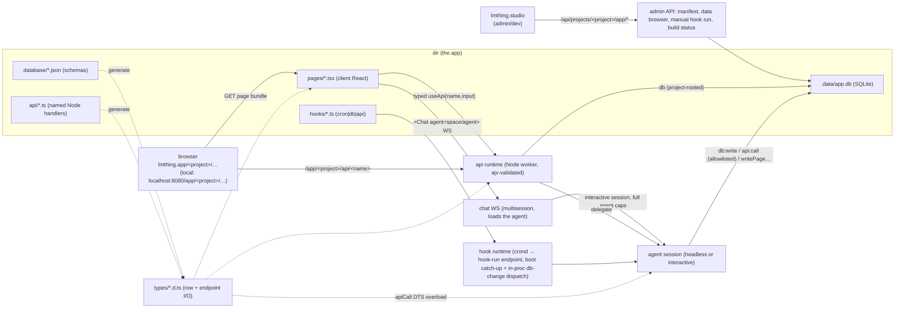

# Project-as-Application — a project owns an app (`database/` + `pages/` + `api/` + `hooks/`)

> A **project** owns an app: the app layer lives at the project level, pages are a real
> **client-side React app** (npm, shared layout), `api/` are **named, typed, Node** endpoints,
> triggers are unified under **`hooks/`**, and every new power is gated behind
> **explicitly-enabled capability globals** wielded by a new **`system-appbuilder`** space that
> THING delegates to. Paths are relative to the org repo root (this IS the org repo).

## Context

lmthing needs **AI-assisted, self-evolving content apps** (lmthing.blog personalized feed,
lmthing.health research page). Today nothing in the space/project format can express a persistent
app: `display()` is per-turn ephemeral, there is no declared data model, and no way for an agent to
build or evolve a UI. This plan adds that as a **project-level app layer** plus the runtime and
capability model to drive it.

## The model

Two layers, each with one job:

- **Space = agent capability** — `agents/ knowledge/ functions/ components/ tasklists/`. Reusable,
  composable. Unchanged by this plan.
- **Project = the app + its data** — `database/ pages/ api/ hooks/ package.json`. The project is the
  thing a user "has as an app"; its spaces are the specialists that maintain it.

Because the database is **project-scoped**, one project can host several specialized spaces (a
research space, a curation space, an editor space) that all read/write the **same** tables and feed
the **same** pages. Hooks orchestrate across them (`trigger: '<space>/<agent>#<action>'`) — a genuine
**multi-agent application**, not one agent with a UI.

## Current project (first-class context)

The app layer is **project-rooted**, so the runtime threads an ambient **`projectRoot`** (abs path
`<root>/<projectId>`) + **`projectId`** as a first-class context field — distinct from `spaceDir`
(per-agent) and `projectSpacesDir` (the `spaces/` dir; precedent: the existing
`LMTHING_PROJECT_SPACES_DIR`). Every `db`/`pages`/`api`/`hooks` capability resolves against
`projectRoot`, **never** `LMTHING_SPACE_DIR`.

- **Set at each entry point** — chat `createSession({ projectId })`; a hook run
  (`/api/projects/<project>/hooks/…`); an api handler (mounted at `/app/<project>/api/*`). A top-level
  THING session with **no** `projectRoot` gets **no** app-capability globals injected (correct — THING
  holds none; it delegates in).
- **Inherited by forks/delegates** — a delegated `system-appbuilder` specialist operates on the
  parent's `projectRoot`. This is the mechanism behind "any agent running within a project reads/writes
  that project's one app."
- Exposed as `LMTHING_PROJECT_DIR` (env parity with `LMTHING_SPACE_DIR`/`LMTHING_PROJECT_SPACES_DIR`);
  the `db` API consumes it programmatically.

## Locked decisions

1. **App layer is project-scoped**, rooted at the project dir, **decoupled from `LMTHING_SPACE_DIR`**
   — so any agent running within a project reads/writes that project's one app, regardless of which
   space it came from. The db never resolves against the running agent's space dir.
2. **SQLite** (`better-sqlite3`) over JSONL. One db file per project on the PVC. The db is
   **synchronous in the agent** (a same-process host call, execShell-class) and **async on the Node
   side** (api/hook handlers — see decision 4). **Backup = a `.sql` dump** (regenerated on backup):
   diff-friendly single text file, dodges WAL-file races. **The dump is disaster-recovery only** —
   `app.db` on the PVC is the live store; it is restored **only when `app.db` is absent** (fresh
   pod / DR), never over live data.
3. **Pages render client-side as real React**, built per project with **npm** (the project's
   `package.json`), with a shared `_app.tsx`/`_layout.tsx`. **No** pod-side component execution and
   **no** descriptor flattening — the client renders real React directly.
4. **`api/` = file-based Node handlers** (Next.js-style), each **named + described + typed** (TS +
   JSDoc I/O), dual-addressed (HTTP route for the browser, `name` for agents). Run in Node
   (worker-isolated), not QuickJS — safe under **per-user pod isolation** (the agent already has
   `execShell` in that pod, so a Node handler is not a capability escalation). **Handlers are `async`**
   (`(input, ctx) => Promise<Output>`): `ctx.db` / `ctx.spawn` / `ctx.apiCall` are message-channel
   **async proxies to the main process** (`await ctx.db.update(...)`), so there is **no cross-thread
   blocking** (no `Atomics` sync-bridge). **The worker is a crash boundary, not a data path** —
   **every db write executes in the main process** (which is what keeps 5's in-process hook dispatch
   and the loop guard sound). A handler kicks background agent work with
   **`ctx.spawn('space/agent#action', input, { onError })`** — fire-and-forget, returns a `runId`; the
   `onError` marks any pending row the handler created as failed, so a dead run never leaves the UI
   spinning. `spawn` is the distinct fire-and-forget cousin of the **result-returning** `delegate`
   that agents/hooks use.
5. **`hooks/` unifies triggers** — `cron`, `database`, (`api`) — each either declarative
   (`trigger: 'space/agent#action'`) or imperative (`handler({ delegate, db, … })`). The db-change
   dispatch runs **in the main process** — every write (agent global, hook handler, worker-proxied
   api handler) funnels through the one host `db` API there — so no SQLite triggers. **Dispatch is
   decoupled from the write**: a (synchronous, in-agent) `db.insert` *enqueues* matching hooks and
   returns immediately; the queue drains on the event loop **after** the current eval unwinds, so a
   hook never fires re-entrantly inside a write. The queue entry carries `hookDepth` + originating-hook
   (the loop guard). `cron` timing rides the pod's **native crond** firing the local hook-run endpoint
   (see Hooks).
6. **Every new power is a gated capability global** — `db:read`, `db:write`, `db:schema`,
   `pages:write`, `api:write`, `hooks:write`, `api:call`. Not listed in agent frontmatter ⇒ not
   injected **and stripped from the typecheck DTS** (stray call fails typecheck, like the fork DTS).
7. **Typed contracts, end-to-end** — TS types + JSDoc are the single source of truth; JSON Schema is
   generated (`ts-json-schema-generator` + `ajv`) and feeds four consumers (handler tsc, request
   validation, the agent's typed `apiCall`, the client). Row types (incl. typed relation fields) are
   generated from `database/`.
8. **A `system-appbuilder` space** (agents + tasklists) does the building; **THING delegates to it**
   and holds **no** app-write capabilities itself. Least-privilege end to end.
9. **Serving — one pod, two Host-anchored TLD aliases.** The pod's `serve.ts` is the single server;
   both domains proxy the **same** pod, and the `Host` sets the root anchor. **`lmthing.app`** is
   root-anchored to `/app` (`lmthing.app/<project>/…` → pod `/app/<project>/…`), so it reaches an app
   and its own `/app/<project>/api/*` but **no** top-level admin `/api/*` (safe by construction).
   **`lmthing.studio`** passes `/app/*` and `/api/*` through unchanged and maps `/` → the Studio
   surface, so Studio previews an app **same-origin** at `lmthing.studio/app/<project>/…` (byte-identical
   to the CLI). **Local CLI**: one origin — `localhost:8080/{studio, app/<project>, api}` coexist exactly
   as prod. See §Serving & domains.
10. **Personal scale** — single-process pod: every write funnels through the one main-process `db` API
    (serialized by the single Node thread), so there are **no physical WAL write races**. The only
    residual is a **logical TOCTOU across agent yields** (read a row → yield/turn boundary → another
    writer commits → resume writes a stale value); last-writer-wins, documented.

## Shape



## Serving & domains

**One pod, two Host-anchored TLD aliases.** The pod's `serve.ts` is the single server (the
studio/chat/computer SPA, the dynamic app, and the management API all live behind it); both public
domains proxy the **same** pod, and the `Host` sets the root anchor. Locally there is one origin and
every prefix coexists exactly as prod.

| Public URL | serves |
|---|---|
| `lmthing.app/` · `lmthing.app/apps` | public app SPA shell (login → app launcher) — static, JWT-free |
| `lmthing.app/install?appId=<id>` | install hand-off from lmthing.store (POSTs to the pod's `/api/apps/install`) |
| `lmthing.app/app/<project>/…` | pod `/app/<project>/…` (the app's pages) |
| `lmthing.app/app/<project>/api/<name>` | pod `/app/<project>/api/<name>` (the app's own api) |
| `lmthing.studio/` | `/studio` (client-side routed) |
| `lmthing.studio/app/<project>/…` | `/app/<project>/…` (preview, byte-identical to the CLI) |
| `lmthing.studio/api/projects/<project>/app` | `/api/projects/<project>/app` (management) |
| **Local CLI** (both) | `localhost:8080/{studio, app/<project>/…, api/…}` |

- **`lmthing.app`** serves the public app SPA shell at `/` (login → the `/apps` launcher listing the
  user's installed apps) and proxies the app itself at `/app/<project>/…` (pages + its own
  `/app/<project>/api/*`) to the user's pod. It reaches **no** top-level admin `/api/*` (nothing on
  this host maps there) — **safe by construction**.

- **Security model — a project-app is SINGLE-USER; the pod is the boundary; the app has NO auth of
  its own.** An app is meant only for its owner. It runs inside that user's private compute pod, which
  IS the security boundary, so the app layer (`pages/ api/ hooks/`) performs **no authentication or
  authorization** — there is no per-app login, no per-request token check in app code. Concretely:
  - **Localhost / dev** — `lmthing serve` serves `localhost:8080/app/<project>/…` (pages + api) with
    **no auth at all**. You are the pod; every request is trusted. This is the reference behaviour.
  - **Prod** — the only auth is the **platform** deciding *which pod* a request goes to. The user logs
    in once on the public `lmthing.app` shell; the platform then routes ALL of that user's `lmthing.app`
    pod traffic — `/api/*`, `/app/<project>/…` pages **and their assets** — to their pod. Because a
    browser page navigation and its relative `<script>/<link>` asset requests can't carry an
    `Authorization` header, the platform session rides a **scoped cookie** set by the shell after login
    (the same per-user JWT the gateway already uses for `/api/*`, just also readable from the cookie).
    This is a *platform* concern (which pod), **not** app auth — the pod never checks it; the gateway
    routes on it. Wiring per the `authentication` / devops skills (Envoy JWT + Lua per-user routing).
- **`lmthing.studio`** passes `/app/*` and `/api/*` through unchanged and maps `/` → the Studio
  surface, so Studio previews a running app **same-origin** at `lmthing.studio/app/<project>/…`.
  (Devops note: because `/app/*` and `/api/*` are per-user **dynamic** content, those prefixes route
  to the user's pod — Studio is pod-routed for them, static only for its own shell.)
- The CLI `serve.ts` router mounts a `/app/<project>/*` handler alongside the existing
  studio/chat/computer catch-all: `…/app/<project>/api/*` → the Node api runtime (method from the
  file, e.g. `POST.ts`); anything else under `…/app/<project>/*` → that project's built page bundle.
  This is **below** the reserved top-level `/api/*` (which 404s before the static fallback), so no
  collision. **SPA fallback matches the build's asset manifest** — any path not in the manifest (and
  not `…/api/*`) serves `index.html`, so dynamic route params containing a `.` (e.g.
  `/feed/my.v2.item`) route correctly instead of 404-ing; no id slugification needed.
- **One build, both environments** — the page bundle uses relative asset URLs and the `useApi` client
  resolves its api base from the `…/app/<project>` prefix in `window.location`, so the identical build
  works under `localhost:8080/app/<project>/`, `lmthing.app/<project>/`, and
  `lmthing.studio/app/<project>/`.

**Admin/dev — authoring & ops (`lmthing.studio`).** Studio is the **admin/dev environment** for
projects/apps. It talks to a management API under the reserved top-level `/api/` (not the app's own
`/app/<project>/api/*`):
- `GET /api/projects/<project>/app` — manifest: pages, tables (+schema), endpoints (name/method/
  I/O), hooks (+ last-run state), build status.
- data browser (read/edit rows), manual **hook run** trigger (`POST /api/projects/<project>/hooks/
  <slug>/run` — the same endpoint crond fires; see Hooks), **build** status/rebuild, page/api/hook/
  schema editors. **App files need new project-file routes** — `database/ pages/ api/ hooks/
  components/ lib/ package.json` are project-root **siblings of `spaces/`**, so the generic
  space-file routes do NOT reach them; add `GET/PUT /api/projects/<project>/app/files/<path>`. That
  route is **path-scoped — it writes exactly the named file and never bulk-`rm`s a directory** — and
  refuses writes under `.data/` (runtime) and `types/` (generated). (No change to the existing
  `writeSpaceFiles` is needed: the app layer lives at the **project root**, which the space-save wipe
  — scoped to `spaces/<spaceId>/` — never touches.)
- Studio embeds a **live preview** iframe of `…/app/<project>/` (same-origin; pages render fetched
  third-party content → strict CSP + sanitize, see §Safety).

## Directory layout (project app layer)

```
<project>/
├── package.json              # app deps (react, ui libs) + build scripts  ← the package.json that matters
├── tsconfig.json             # optional; a sensible default is injected
├── database/
│   └── <table>.json          # table schema; table name = basename
├── pages/                    # client-side React app, file-based routing
│   ├── _app.tsx              # optional: root wrapper — providers / shared context for ALL pages
│   ├── _layout.tsx           # optional: persistent chrome (nav, header) around every page
│   ├── index.tsx             # route "/"
│   ├── stats.tsx             # route "/stats"
│   └── items/
│       ├── index.tsx         # route "/items"
│       └── [id].tsx          # route "/items/:id"   (dynamic segment)
├── components/               # shared React components for pages (NOT agent catalog components)
│   └── <Name>.tsx
├── lib/                      # optional shared client TS (utils, hooks)
├── api/                      # file-based Node API routes — endpoint = dir, HTTP method = filename
│   ├── feed-list/
│   │   └── GET.ts            # GET   ".../api/feed-list"   name "feedList"
│   ├── mark-read/
│   │   └── POST.ts           # POST  ".../api/mark-read"   name "markRead"
│   └── items/
│       └── [id]/             # dynamic segment; one dir, many methods
│           ├── GET.ts        # GET   ".../api/items/:id"   name "getItem"
│           └── PATCH.ts      # PATCH ".../api/items/:id"   name "updateItem"
├── hooks/
│   ├── refresh-feed.ts       # type "cron"
│   └── enrich-new-items.ts   # type "database"
├── types/                    # GENERATED (build artifact, git-ignored): row + endpoint I/O types
│   └── generated.d.ts
└── .data/                    # project-app runtime state (NOT the root .lmthing/ that hosts projects)
    ├── app.db                # SQLite (WAL) — live rows
    ├── app.sql               # dump for backup (regenerated on backup; restored on boot only if app.db absent — DR)
    └── hooks-state.json      # cron last-run / backoff / pending-queue state
```

## File formats

### `database/<table>.json` (table name = basename)

Table **and every column carry a required `description`** — the schema is the agent's mental model of
the data, so it must be self-explanatory, not just typed. Relationships to other tables are declared
as foreign keys + named relations.

```json
{ "title": "Feed items",
  "description": "One personalized item in the user's feed.",
  "columns": {
    "id":        { "type": "string",  "description": "unique id",                          "primaryKey": true, "generated": "uuid" },
    "title":     { "type": "string",  "description": "headline shown in the feed",          "required": true },
    "url":       { "type": "string",  "description": "canonical source URL (dedupe key)",    "required": true, "unique": true },
    "score":     { "type": "number",  "description": "relevance rank; higher = more relevant","default": 0 },
    "tags":      { "type": "json",    "description": "array of topic tag strings" },
    "read":      { "type": "boolean", "description": "whether the user has opened it",        "default": false },
    "createdAt": { "type": "date",    "description": "when the item entered the feed",        "generated": "now" } },
  "relations": {
    "comments": { "hasMany": "comments", "via": "feedItemId", "description": "notes the user attached" } } }
```

```json
// database/comments.json — the "many" side of the relationship
{ "title": "Comments",
  "description": "A note the user attached to a feed item.",
  "columns": {
    "id":         { "type": "string", "description": "unique id", "primaryKey": true, "generated": "uuid" },
    "feedItemId": { "type": "string", "description": "the feed item this comment belongs to", "required": true,
                    "references": { "table": "feed_items", "column": "id", "onDelete": "cascade" } },
    "body":       { "type": "string", "description": "the comment text", "required": true },
    "createdAt":  { "type": "date",   "description": "when the note was written", "generated": "now" } },
  "relations": {
    "item": { "belongsTo": "feed_items", "via": "feedItemId", "description": "the item being commented on" } } }
```

- **Types** `string|number|boolean|date|json`; per-column flags `primaryKey` (exactly one;
  `generated:"uuid"` recommended), `required`, `unique`, `default`, `generated` (`uuid`|`now`).
- **`description` is mandatory** on the table and on every column (and on every relation). The loader
  **fails loud** if any is missing — it's the single source of the agent's schema view and of the
  generated row-type JSDoc (agent- and human-facing).
- **Foreign keys** — a column's `references: { table, column?, onDelete? }` maps to a real SQLite
  `FOREIGN KEY` (`column` defaults to the target's primary key; `onDelete` = `cascade|setNull|restrict`,
  default `restrict`). Enforced by SQLite with `PRAGMA foreign_keys=ON`.
- **Relations** — a `relations` map names navigable links (`belongsTo`/`hasMany` → target table,
  `via` = the FK column). They drive: generated **typed relation fields** on the row types
  (`FeedItem.comments: Comment[]`, `Comment.item: FeedItem`), and **`db.query('feed_items', { include:
  ['comments'] })`** to expand them in one call (a join under the hood).
- Maps to a real `CREATE TABLE`. **Additive-lenient evolution** via `db.addColumn` → `ALTER TABLE ADD
  COLUMN` (new tables/relations via `db.createTable`). Rows live in `<project>/.data/app.db`; dumped to
  `<project>/.data/app.sql` for the existing GitHub backup. (`.data/` — **not** the root `.lmthing/`
  that hosts all projects.)

### `pages/` — client-side React, file-based routing

**Routing conventions** (only `.tsx` files that are *not* `_`-prefixed and not under
`components/`/`lib/` are routes):

| File | Route |
|---|---|
| `pages/index.tsx` | `/` |
| `pages/stats.tsx` | `/stats` |
| `pages/items/index.tsx` | `/items` |
| `pages/items/[id].tsx` | `/items/:id` |
| `pages/_app.tsx` | (not a route) root wrapper for every page — context providers, query client |
| `pages/_layout.tsx` | (not a route) persistent layout around every page |

**Page contract** — a default-exported React component. Route params arrive as `params`; data comes
from the **generated typed client** `useApi(name, input)` (client-side fetch to `api/`), *not* a
pod-side loader:

```tsx
// pages/items/[id].tsx  → route /items/:id
import type { FeedItem } from '../../types/generated'   // generated from database/feed_items.json
import { useApi } from '@app/runtime'                   // provided by the per-project build runtime

export default function ItemPage({ params }: { params: { id: string } }) {
  const { data: item, isLoading } = useApi('getItem', { id: params.id })  // typed to endpoint I/O
  if (isLoading) return <Spinner />
  return <article><h1>{item.title}</h1>…</article>
}
```

- `_app.tsx` wraps every page (e.g. a TanStack Query provider + design-system theme); `_layout.tsx`
  gives shared chrome. This is why the app is built as **one bundle**, not per-page modules — shared
  layout + context only exist if pages compile together.
- **Imports are bounded**: React, the project's `package.json` deps, `@lmthing/ui`/`@lmthing/css`
  (design system — hard token gate still applies, no raw colors), `@app/runtime` (`useApi`, router
  params), `@app/types` (generated). Not arbitrary in-repo reach.
- **Client data surface (`@app/runtime`)** — `useApi(name, input, opts?)` is a **query** hook
  (`{ data, error, isLoading, refetch }`, keyed by `[name, input]`, for GET/DELETE endpoints).
  Mutations use **`useApiMutation(name, { invalidates? })`** → `{ mutate(input): Promise<Output>,
  isPending, error }` (POST/PATCH/PUT; `invalidates: string[]` re-fetches those queries — explicit for
  v1 predictability), plus the bare **`apiCall(name, input): Promise<Output>`** for one-shot/non-React
  calls (e.g. `markRead` on open). All three are typed from the endpoint's `Input`/`Output`.
- **Build**: per-project bundle (esbuild/Vite) in the pod, **on space/project save** (not per
  request), cached; served as static assets under `/app/<project>/*`. **SPA fallback matches the
  build's asset manifest** — a path not in the manifest (and not `…/api/*`) serves `index.html`, so
  dotted route params route correctly. Agent-authored page edits (`pages:write`) re-trigger the build.

### `api/<route>/<METHOD>.ts` — named, described, typed Node handler

**The endpoint route is a directory; the HTTP method is the filename** (`GET.ts`, `POST.ts`,
`PUT.ts`, `PATCH.ts`, `DELETE.ts`). One route dir can host several methods (a `GET.ts` + `POST.ts`
on the same path), each its own named endpoint. `name` is the stable agent-facing id; `Input`/
`Output` are the contract:

```ts
// api/mark-read/POST.ts   → HTTP  POST ".../api/mark-read" ; agent name "markRead"
/** Mark a feed item as read. */
export const name = 'markRead'
export const description = 'Mark a single feed item read, by its id.'

export interface Input  { /** feed item id */ id: string }
export interface Output { ok: boolean }

export default async function handler(
  input: Input,
  ctx: { db: AsyncDbApi; spawn: SpawnFn; apiCall: ApiCallFn },
): Promise<Output> {
  const n = await ctx.db.update('feed_items', { where: { id: input.id }, set: { read: true } })
  return { ok: n > 0 }
}
```

- **Method = filename** — no `method` export; the router maps `api/mark-read/POST.ts` to
  `POST /…/api/mark-read`. Non-method filenames in a route dir are ignored (a route dir may also hold
  local helpers, or share types via a sibling `types.ts`).
- **Dual-addressed**: browser calls the **HTTP route + method**; an agent calls by **`name`** via
  `apiCall('markRead', { id })`. Renaming a file/route never breaks an agent allowlist — the `name`
  is the contract. **`name` unique per project** (loader validates fail-loud).
- Runs in **Node**, worker-isolated (a bad handler crashes the app, not the pod), with access to the
  project's npm deps and an **`async`** ctx of project-rooted `db` (`AsyncDbApi`), `spawn`, and
  allowlisted `apiCall` — all **async message-channel proxies that execute in the main process**
  (writes fire db hooks there; the worker is a crash boundary only, never a second writer).
- **Error contract** — a handler throws `HttpError(status, message, details?)` (exported by
  `@app/runtime`); the runtime maps it to that HTTP status with body `{ error: { status, message,
  details? } }`. Any other throw → `500` with a generic body (the real message is logged pod-side,
  never leaked). An ajv input mismatch → `400` `{ error: { status: 400, message: 'invalid input',
  details: <ajv errors> } }`. Agent-side, `apiCall` surfaces the same `error` object as a thrown
  yield error (retryable, per the turn-loop rules) — one error shape across browser and agent.
- **Method-aware input**: `Input` is **one object**; where each field travels is derived from the
  method + the route's dynamic segments, not declared per-field. **Path params (`[id]`) always merge
  into `Input`**; GET/DELETE take the rest from the **query string**, POST/PATCH/PUT from the **JSON
  body**. `ajv` validates the *assembled* Input with `coerceTypes: true` (a GET's string
  `unreadOnly=true` coerces to boolean). Nested + dynamic: `api/items/[id]/PATCH.ts` →
  `PATCH .../api/items/:id`, `:id` in `input.id`.
- An api handler **may `spawn`** (not `delegate`) — so a "refresh" button POST can kick a headless
  agent run **fire-and-forget** and return immediately, with `onError` to fail-close any pending row
  it wrote. This subsumes the "api hook" case.

### `hooks/<slug>.ts` — unified triggers

A default-exported hook object. Declarative `trigger` (shorthand) **or** imperative `handler`
(decides *whether*/*how* to invoke an agent):

```ts
// hooks/refresh-feed.ts — cron
export default {
  type: 'cron',
  every: '30m',                                  // "<n>(m|h|d)" (clamped ≥5m) or  daily: "HH:MM"
  trigger: 'curation/curator#refresh',           // declarative: run this agent#action
  budget: { maxEpisodes: 20, maxWallClockMs: 600000 },
}
```

```ts
// hooks/enrich-new-items.ts — database
export default {
  type: 'database',
  on: { table: 'feed_items', event: 'insert' },   // insert | update | remove
  budget: { maxEpisodes: 10 },
  handler: async ({ row, db, delegate }) => {      // imperative: gate + orchestrate
    if (row.enrichedAt) return                     // idempotence
    await delegate('research/curator', 'enrich', { input: row })
  },
}
```

- **`database` dispatch is in-process and decoupled** — the host `db.*` write path **enqueues**
  matching hooks after a commit and returns; the queue drains on the event loop after the current
  eval, so hooks never fire re-entrantly inside a write. No SQLite triggers, no polling.
- **`cron` rides the pod's native crond** — the hooks loader regenerates a crontab (one line per
  cron hook; ≥5m granularity) whose entries hit the local **hook-run endpoint**
  (`POST localhost:8080/api/projects/<project>/hooks/<slug>/run` — the same endpoint Studio's
  manual run uses). All state — last-run, coalescing, the budget queue (`hooks-state.json`) — lives
  behind the endpoint, so cron is only the timer; `hooks:write` regenerates the crontab. crond
  cannot catch up a window missed while the pod was down: on boot `serve.ts` reads
  `hooks-state.json` and runs each overdue hook **once** (coalesced). Local dev (no crond touched
  on a developer machine): `lmthing serve` falls back to an in-process 60s tick driving the same
  endpoint logic. Hooks only run under a live `lmthing serve` — a one-shot CLI run has no dispatch.
- `api`-type hooks are optional sugar (bind a route → fire-and-forget agent); prefer an `api/`
  handler that `delegate`s.

### Typed-contract pipeline (TS + JSDoc → JSON Schema → 4 consumers)

TS types + JSDoc are the single source of truth. During the per-project build:

1. **Handler tsc** — the handler is typechecked against its own `Input`/`Output`; a contract-violating
   handler fails the build.
2. **Request/response validation (method-aware)** — `ts-json-schema-generator` emits JSON Schema from
   `Input`/`Output`. `Input` is **one object**; field routing is derived from the method + the route's
   dynamic segments: **path params merge into `Input`**, GET/DELETE take the rest from the **query
   string**, POST/PATCH/PUT from the **JSON body**. `ajv` validates the *assembled* Input (path ∪
   query-or-body) with `coerceTypes: true` before the handler runs (typed 400 on mismatch). (This runs
   in the **Node/cli server layer** where npm is available; db-row validation stays hand-rolled in
   `libs/core`, which is dependency-light — two contexts, two regimes, by where each executes.)
3. **The agent's `apiCall`** — the same JSON Schema is injected as a **typed `apiCall` overload into
   the agent's DTS** (`apiCall('markRead', { id: string }): { ok: boolean }`), so a malformed call
   **fails typecheck inside the agent's sandbox**, plus the `{name, description}` + schema is surfaced
   as the agent's tool signature (JSDoc → field descriptions).
4. **The client** — pages import the same `Input`/`Output` and generated **row types** from
   `database/` (`FeedItem` from `feed_items.json`), so types flow **data model → api I/O → page
   props** off two schema sources.

## Chat

Chat is **not a declared surface** — there is no `chats/` dir. It is a drop-in client component plus a
standard pod endpoint; the binding to a specific agent is a runtime argument, not a file.

- **`<Chat agent="space/agent" />`** (from `@app/runtime`) — a page drops it in, optionally pointing
  at any `space/agent` in the project. It renders the agent's turn-by-turn stream with the **catalog
  descriptor renderer** (`@lmthing/ui` `render-descriptor`) — this is **the one place that renderer
  lives inside the app** (pages are real React; the chat widget is the exception), and it round-trips
  `ask()` form answers over the same socket, exactly as `/chat` does.
- **Always-available chat endpoint — mostly exists already.** Session **creation**
  (`POST /api/sessions` → `SessionManager.createSession`) already accepts `{ spaceDir?, agentSlug?,
  projectId? }`; extend it with a project-relative `spaceRef` so a **new session loads that specific
  agent** (its `instruct`, knowledge, components, and capabilities). The WS (`/api/ws?sessionId=`)
  then binds by session id exactly as today — **no WS-protocol change**. No per-project declaration —
  the endpoint is standard on every pod, so any app can start an agent conversation.
- **Full capability inheritance** — a chat session runs with the agent's **complete declared
  capabilities** (`db:*`, `apiCall`, authoring, …), project-rooted like everywhere else. No
  chat-level narrowing. So the chat agent is a first-class db writer: its `db` writes fire `database`
  hooks (loop guards apply) — chat becomes a **live control surface** ("tell the curator to add X →
  row inserted → hook enriches → the page updates").
- **History saved inside the space** — persisted at `<project>/spaces/<spaceId>/sessions/<id>` in the
  **same snapshot form** as project sessions. This is **net-new plumbing** (today sessions persist
  *only* at `<project>/sessions/<id>`, and `<project>/spaces/<spaceId>/sessions/` is currently
  *excluded* from space-file reads): parameterize the snapshot dir by `spaceId` (stored on the session
  entry at create-time), add a `listSpaceSessions(root, projectId, spaceId)` mirroring
  `listProjectSessions`, and wire resume to compute the per-space dir. `Session.resume` itself is
  reused unchanged. (`**/sessions/` is backup-excluded today, which *aligns* with keeping transcripts
  local — the durable artifact is the db row the chat produced; flag if chat history itself should be
  made durable.)
- **Auth/budget** — runs as the authenticated user (per-pod), on the user's budget windows.

## Capability globals (explicit-enable, DTS-gated, host-enforced)

Declared per agent in `instruct.md` frontmatter under **one key**: `capabilities:` — a list whose
entries are either a **bare capability id** (full scope) or a **map carrying that capability's
configuration** (narrowed scope). Not listed ⇒ not injected **and** stripped from the typecheck
DTS. Read-only fork roles (`explore`/`plan`) can never receive a write/authoring cap (intersected
with `capabilities.allowWrite`). The key is **new in this plan** (today's loader keys: `title`,
`defaultAction`, `knowledge`, `functions`, `components`, `canDelegateTo`, `actions`).

**These are a new *shape*, not a new flag.** Today's `CapabilityProfile` is a set of **boolean
permission flags** (`ask`, `orchestrate`, `delegate`, `allowWrite`, …) gating whole globals. A
`capabilities:` entry is a **scoped resource grant** — an id **plus** a config payload
(`db:read { tables:[…] }`, `api:call { allow:[…] }`). The **threading path is reused** (the grant
rides the same session→fork→delegate→`createChildVM` plumbing as the flags), but the **data model is
extended** (structured per-verb/per-resource fields, not another boolean) and enforcement is net-new:
the flags gate **injection** only; scoped grants additionally gate **each invocation** (the
`db`/`apiCall` impls check `tables`/`allow` on every call). This is **orthogonal to `functions:`**,
which gates *space* functions — an agent with `functions: []` can still hold `db:read` and vice versa.

```yaml
capabilities:
  - db:read: { tables: [sources, raw_items] }   # narrowed: only these tables
  - db:write: { tables: [raw_items] }           # per-VERB scope — read wide, write narrow
  - api:call: { allow: [webSearch, markRead] }  # the allowlist IS api:call's config
  - pages:write                                 # bare = full scope
```

The loader validates config **fail-loud** against a per-capability schema: unknown capability id,
unknown config key, `tables` naming a table that doesn't exist in `database/`, or a bare `api:call`
(its `allow` is required — there is no "call anything") all fail the space load. **This gate is
net-new** — agent `instruct.md` frontmatter has *no* unknown-key validation today (unrecognized keys
are silently ignored), so without it a typo'd capability would silently grant nothing; copy the
allow-list-Set pattern from `validateKnowledgeOptionFrontmatter`. **`tables` existence is checked only
where a project context exists**: project-scoped spaces validate against their own `database/`; a
**bare** (project-agnostic) cap on a system space — e.g. `system-appbuilder` — defers the table check
to the project it's resolved into at run time.

| Capability | Global surface | Tier |
|---|---|---|
| `db:read`     | `db.query`, `db.tables`                 | data (read) |
| `db:write`    | `db.insert`, `db.update`, `db.remove`   | data (mutate rows) |
| `db:schema`   | `db.createTable`, `db.addColumn`, …     | **authoring** (evolve the model) |
| `pages:write` | `writePage(route, src)`                 | **authoring** (+ triggers rebuild) |
| `api:write`   | `writeApi(route, src)`                  | **authoring** (+ route reload) |
| `hooks:write` | `writeHook(slug, def)`                  | **authoring** (+ hook reload) |
| `api:call`    | `apiCall(name, input)`                  | outbound (named allowlist) |

- **`db:write` vs `db:schema` are different trust levels** — a curator adds rows without being able
  to restructure the model.
- **`{ tables: [...] }` narrows each db capability to named tables**, independently per verb
  (`db:read`/`db:write`/`db:schema` each take their own list; bare = all tables). Host-enforced
  inside the `db` API; a violation errors naming the allowed tables (same shape as
  `canDelegateTo`). This is how two agents in one project stay in their own lanes on a shared db —
  and how one agent reads a table it may not mutate.
- **Authoring globals are "write + apply"**, not just file writes: `writePage` triggers the
  per-project rebuild, `writeApi`/`writeHook` reload the route/hook registry, `db:schema` runs the
  migration. That's what makes self-evolution live.
- **`api:call` allowlist is by name.** External services are **named bindings** (`{ name,
  description }` → hidden URL + key the model never sees — keeps secrets out of the transcript);
  own-project endpoints resolve in-process by `name`. The allowlisted, described set **is the agent's
  callable-tool menu**. Frontmatter: `api:call: { allow: [markRead, weatherLookup] }` (the allowlist
  is the capability's config, not a separate key); violation → error naming the allowed names (same
  shape as `canDelegateTo`).
- **Two execution regimes (agent vs Node).** In the **agent** sandbox `db.*` is a **synchronous**
  host call (execShell-class; fast local SQLite in the same process — no turn boundary), while
  `apiCall` is a **value-yielding** global (fetch/delegate-class — it runs a Node handler, so it must
  yield, not block the thread). On the **Node side** (api/hook handlers) the same `db` is **`async`**
  (`AsyncDbApi`, a cross-thread proxy — `await`). So `DbApi` has **two typed surfaces** generated from
  one schema: sync for the agent DTS, `Promise`-returning for handler/hook types.

**Layering:** `libs/core` defines the `DbApi`/`AsyncDbApi`/`ApiCallFn` **interfaces**, injects the
gated globals, and owns the DTS (browser-safe, no native deps) — driven by a **capability→
{inject, dts} registry** so injection and the ambient DTS stay in lockstep (see §Phases 1: the DTS
becomes fully modular). `libs/cli` provides the **implementations** — `better-sqlite3`-backed `db`,
the Node api runtime, the build, and the crontab sync + hook-run endpoint — handed in the same way
`fetch`/`execShell` host primitives are today.

## The `system-appbuilder` space (the expertise; THING delegates)

A **system** space (ships, auto-syncs from source on boot, **universally delegatable** — so THING
gets access for free). The globals are the *primitives*; this space is the *expert that wields them*.

| Agent | Capabilities | Role |
|---|---|---|
| **app-architect** | `project:manage` (create/select) + *(delegation)* | binds the target project, then plans the app and fans out to the specialists (mirrors architect's `synthesize_and_run`/`iterate_space` tasklists) |
| **data-modeler** | `db:schema`, `db:read` | designs/evolves tables |
| **page-builder** | `pages:write`, `db:read` | authors pages / `_layout` / components; owns npm + build |
| **api-author** | `api:write`, `db:read` | authors named typed endpoints |
| **automator** | `hooks:write` | wires cron/db hooks; knows the loop-guard rules |

**THING stays an orchestrator, not a mutator** — it holds `canDelegateTo` for `system-appbuilder` but
gets **none** of the app capabilities directly. "Build me a personalized feed" → delegate to
`system-appbuilder/app-architect#build` → architect fans out to modeler → page-builder → automator.
Because db is **project-rooted**, these delegated specialists mutate **the current project's** app,
not the system space they live in.

**Binding the target project (explicit).** The authoring globals resolve against the ambient
`projectRoot` (§Current project), which must be set before any `db:schema`/`pages:write`/`api:write`
fires. `app-architect` therefore opens with a `project:manage` step: **`selectProject(id)`** (bind an
existing project) or **`createProject(id, { title })`** (scaffold `<root>/<id>/` — default
`package.json`/`tsconfig`, empty `database/pages/api/hooks` — and bind it; reuses
`SessionManager.createProject`; `'system'` reserved, fails loud on a missing/duplicate id). The
fanned-out specialists **inherit** that `projectRoot`. "Build me a feed" with no project ⇒ architect
`createProject`s (name from the request) before decomposing, so the authoring globals are never
rootless.

## Safety

- **Hook loop guard** (three cheap rules): **depth cap** — every hook-triggered session carries
  `hookDepth`; cascaded writes increment it; past a cap (3) writes stop firing hooks. **Self-write
  exclusion** — a db hook never fires on writes made by its *own* triggered session (a different hook
  still can, within the cap). **Per-hook cooldown/coalesce** — a hook fires at most once per N
  seconds; rapid same-table writes coalesce. Host-enforced regardless of what an agent authors.
- **Budget-exhaustion queue** — when the budget window is spent: **at most one pending entry per
  hook** (dedupe by slug — a cron hook that missed 100 windows runs once), drained by **retry on the
  next run attempt** — the pod gets no push signal from the gateway, so a pending entry simply stays
  queued and every subsequent trigger (next cron fire, next db write, boot catch-up) re-checks the
  window and runs once it has rolled over. **User-facing api hooks surface the deferral** ("queued,
  runs when budget resets") while cron/db coalesce silently. Ties into the existing 1d/7d/30d
  windows rather than a separate budget island.
- **Authz = per-user pod isolation.** No cross-user routes; a network-reachable api handler runs in
  *that user's* pod only. Node handlers are worker-isolated for crash resilience, not as a security
  boundary (the pod is the boundary).
- **npm supply chain** — `pages:write`/`page-builder` can pull deps into the user's pod; gate new
  dependency installs behind the same allowlist / user-confirm as `api:call`, so a hallucinated
  package name isn't a silent install.
- **LLM-authored pages render third-party content (XSS surface)** — pages display fetched news, so a
  poisoned item can carry markup/script. **`lmthing.app` is safe by construction** (root-anchored to
  `/app`, no admin `/api/*` reachable); the one same-origin spot is the **Studio preview**
  (`lmthing.studio/app/…` shares an origin with the admin API). **Mandatory control regardless of
  origin**: a **strict CSP** on served pages (no inline script; `connect-src` limited to the app's own
  api) + **sanitize all rendered fetched content** — with these, a self-XSS can neither exfiltrate nor
  reach the admin API. Optional hardening: point Studio's preview iframe at the `lmthing.app` origin.
  Contained to one user's pod either way (no cross-user reach).

## Boot sequence (per project, ordered)

`serve.ts` on boot, for each project with an app:

1. **Restore (DR only)** — if `.data/app.db` is **absent** and `.data/app.sql` present, rebuild from
   the dump; if `app.db` exists (PVC intact), **do nothing** (never clobber live data).
2. **Open db** + `PRAGMA foreign_keys=ON`.
3. **Reconcile schemas** — read `database/*.json` (the **sole** source of truth), diff vs the live
   tables, apply **additive** migrations (`createTable`/`addColumn`). **Fail loud** on a non-additive
   divergence (rename/drop/type change) and surface to Studio rather than silently dropping data.
4. **Generate types/DTS overlays** from the reconciled schema + endpoint contracts.
5. **Build pages if stale** (hash/mtime-cached). The app is **not served until its first build
   completes** → provisioning should pre-build so a cold pod isn't blank.
6. **Regenerate the crontab** from all projects' cron hooks — **crond starts empty on a fresh pod, so
   this must run on boot**, not only on `hooks:write`. Local dev: start the in-process 60s tick.
7. **Boot catch-up** — read `hooks-state.json`; run each overdue cron hook **once** (coalesced),
   respecting the budget window.
8. **Serve** — the runtime origin (`/app/<project>/*` + app api) and the admin API (§Serving).

Hard ordering: 1→2→3, 3→4→5, 3 before 7, serving last.

## Phases & order

1. **Core db + capability globals + DTS refactor** — `libs/core/src/db/` (`DbApi` interface with
   **two typed surfaces — synchronous for the agent, `Promise`-returning `AsyncDbApi` for Node
   handlers/hooks**; hand-rolled schema validate — required descriptions, exactly-one PK, and
   **`references`/`relations` resolve to existing tables/columns**, fail-loud). **Make the DTS fully
   modular** (`typecheck/library-dts.ts` + `buildAmbientDts` in `exec/bootstrap.ts`): split the
   monolithic `COMMON_DTS` into one strippable fragment per gated global and drive **both** injection
   (`createChildVM`) and the ambient DTS from a **single capability→{inject, dts} registry**, so "not
   listed ⇒ not injected **and** absent from the DTS" is structural — this also fixes the current
   `writeFileRaw`/`execShell` bug (declared unconditionally in `COMMON_DTS` though injected only under
   `allowWrite`). Gated globals in `globals/host-tools.ts`; config-bearing `capabilities:` frontmatter
   (bare id or `id: { config }`; per-capability config schema, **net-new fail-loud** — agent
   frontmatter is unvalidated today) in `spaces/load.ts`. Add **`projectRoot`/`projectId` as a
   first-class context field** (§Current project), threaded through `session.ts`/`delegate.ts`/
   `fork.ts`. Db is **project-rooted** (not `LMTHING_SPACE_DIR`); a session with no `projectRoot` gets
   no app globals. **Keep all system spaces green** — the DTS refactor must be behavior-preserving;
   re-typecheck `system-spaces/*` and audit frontmatter (see §Space-format impact & system-space refactor).
2. **cli db impl + project app loader** — `better-sqlite3` store (`PRAGMA foreign_keys=ON`; `query`
   `include` = relation join) + **conditional restore** (rebuild `app.db` from `app.sql` **only when
   the db file is absent** — DR only) + **boot schema reconcile** (diff `database/*.json` vs live
   tables → additive migrations; fail loud on non-additive divergence); load `database/pages/api/hooks`
   at **project** scope. **No change to `writeSpaceFiles` needed** — the app layer lives at the project
   root (sibling of `spaces/`), which the space-save wipe (scoped to `spaces/<spaceId>/`) never
   touches; the **new** app-file route (`PUT /api/projects/<project>/app/files/<path>`) is instead
   authored **path-scoped** and refuses `.data/`/`types/`. **Backup — two concrete edits in
   `libs/cli/src/server/backup.ts`**: add `**/.data/app.db` to `EXCLUDE_PATTERNS`, and slot a
   **pre-dump step** into `runBackup` (right before `git add -A`) that regenerates
   `<project>/.data/app.sql` for every project with a db (`app.sql` + `hooks-state.json` stay tracked;
   the binary db never is).
3. **api runtime** — Node file-based router (method = filename), worker isolation, **`async` handlers**
   (`Promise<Output>`; `db`/`spawn`/`apiCall` are async cross-thread proxies to the main process — no
   `Atomics` blocking), **method-aware** ajv validation from generated schema (path ∪ query for
   GET/DELETE, path ∪ body for POST/…, `coerceTypes`), `spawn` fire-and-forget with `onError`; mount
   under `/app/<project>/api/*` in `serve.ts` (below the reserved `/api/*`).
4. **Typed-contract build** — `ts-json-schema-generator` + row-type generation → `types/generated.d.ts`
   + `apiCall` DTS overloads + agent tool signatures.
5. **pages build + serving** — per-project esbuild/Vite bundle (`_app`/`_layout`, `@app/runtime`
   `useApi`/`useApiMutation`/`apiCall`, design-system imports; relative assets + runtime-resolved api
   base). `serve.ts` serves it under `/app/<project>/*` with **asset-manifest SPA fallback** (a path
   not in the build manifest and not `…/api/*` → `index.html`; dotted route params route correctly),
   below the reserved `/api/*`.
6. **hooks runtime** — in-proc db-change dispatch (**decoupled post-commit queue** — enqueue on write,
   drain after the eval; no re-entrancy) + hook-run endpoint + crontab sync (pod crond, **regenerated
   on boot**; in-process 60s tick as local-dev fallback) + boot catch-up + loop guard + budget queue;
   `SessionManager.runHeadless({ projectId, spaceRef, agentSlug, message, budget })` (**new** —
   today's manager only drives interactive `sendMessage` sessions).
7. **Chat** — extend session-create (`POST /api/sessions`, which already takes `{ spaceDir,
   agentSlug, projectId }`) with a project-relative `spaceRef`; WS binding by `sessionId` unchanged.
   Load that agent (full caps, project-rooted); **persist history under the space** — net-new: a
   `spaceId`-parameterized snapshot dir (`<project>/spaces/<spaceId>/sessions/`) + a `listSpaceSessions`
   (today sessions persist only at `<project>/sessions/`), `Session.resume` reused; ship the
   `<Chat agent="space/agent">` component (`@app/runtime` + `@lmthing/ui` `render-descriptor`,
   `ask()` round-trip).
8. **Studio admin/dev + `lmthing.app`/`lmthing.studio` Host anchoring** — Studio management API
   `/api/projects/<project>/app` (manifest, data browser, manual hook run, build status) + **app-file
   routes** (`GET/PUT /api/projects/<project>/app/files/<path>` — **path-scoped**, refuse
   `.data/`/`types/`) + Studio UI (editors, data browser, live `…/app/<project>/` preview iframe).
   Edge: both TLDs proxy the **same** pod — `lmthing.app` root-anchored to `/app` (no admin `/api/*`
   reachable), `lmthing.studio` passes `/app/*` + `/api/*` and previews same-origin (Studio pod-routed
   for those prefixes; Envoy JWT + per-user routing; wiring per `authentication`/devops skills).
9. **`system-appbuilder` space + THING wiring + system-space audit** — new appbuilder agents/tasklists/
   knowledge (config-bearing `capabilities:`); `writePage/writeApi/writeHook/writeTableSchema` +
   `createProject`/`selectProject` authoring globals; THING `canDelegateTo`. **Refactor the existing
   system spaces to abide** (frontmatter allow-list, re-typecheck vs the modular DTS, `system-engineer`
   writes → `projectRoot`) — see §Space-format impact & system-space refactor.
10. **Demo + docs** — `fixtures/demo-feed-project/`; **`SPACE_DEVELOPMENT.md`**: new "Project apps"
    section **+ the space-format changes** (the `capabilities:` key, fail-loud validation, two-surface
    db); **update `system-architect`'s space-format knowledge** so it scaffolds current-format spaces
    (it is the `app-architect` template — see §Space-format impact); `CLAUDE.md` gotchas (project-rooted
    db; api in Node; pages client-side; hooks in-proc dispatch; `<Chat>` is the one place the descriptor
    renderer lives in the app; agent chat history under the space, not the project).

## Verification (end-to-end, local)

1. `pnpm build && pnpm typecheck && pnpm test` — new unit tests green (db CRUD + additive evolution,
   schema→JSON-Schema→ajv, capability gating strips DTS, hook due/backoff + loop-guard as pure
   functions, project-scoped loader).
2. Scratch project with `database/feed_items.json`, `api/mark-read/POST.ts` + `api/feed-list/GET.ts`,
   a `pages/index.tsx`, a `hooks/refresh-feed.ts`; `lmthing serve`.
3. `GET localhost:8080/app/<project>/` serves the built page (client-side), which calls
   `GET …/app/<project>/api/feed-list`; `GET /api/projects/<project>/app` returns the manifest.
4. Mock streamFn emitting `db.insert('feed_items', …)` via a delegated `curator`: manual hook run →
   rows in `app.db`; page shows them; `POST …/app/<project>/api/mark-read` flips `read`; page
   reflects it.
5. `apiCall('markRead', { id: 123 })` with `id` as a number **fails the agent's typecheck** (DTS
   overload); with a name not in the allowlist → host error naming allowed names.
6. cron `every:"5m"` (local fallback tick — same endpoint logic crond drives in the pod); restart →
   one boot catch-up run; immediate second restart → **no** double-run; budget-exhausted → single
   coalesced pending entry, runs on the next attempt after the window rolls.
7. Chat: `<Chat agent="curation/curator">` opens a WS session that loads the curator; a message that
   makes it `db.insert` a feed item lands in `app.db` (fires the enrich hook) and the page updates;
   history is written under `<project>/spaces/curation/sessions/` and resumes on reconnect.
8. Backup: `runBackup` against a `file://` remote — `app.sql` + schemas + pages + api + hooks +
   hooks-state committed; `sessions/` not; restore rebuilds `app.db` from `app.sql`.

## Space-format impact & system-space refactor

This plan **extends the space/agent format**; the existing system spaces (`system-global`,
`system-engineer`, `system-architect`, `system-research`, `user-memory`, `user-thing`) must be
refactored to **abide**. They ship and **auto-adopt source updates on boot** (pristine re-sync), so
editing the source tree (`libs/core/system-spaces/*`) *is* the whole migration — no per-user data change.

**Format changes:**
- **New agent-frontmatter key `capabilities:`** (config-bearing; bare id or `id: { config }`).
  *Absent ⇒ no app-capability globals*, so existing system agents need it only where they gain a
  power. Today's keys stay (`title`, `defaultAction`, `knowledge`, `functions`, `components`,
  `canDelegateTo`, `actions`); `capabilities:` is additive.
- **Frontmatter becomes validated fail-loud.** Agent frontmatter has *no* unknown-key validation today,
  so introduce the gate carefully: keep the top-level key set an **allow-list that includes every key
  the system spaces already use** (audit first) and validate the `capabilities:` *payload* against the
  per-capability schema — otherwise a stray/legacy key in a system space starts failing the load.
- **Per-agent DTS is now composed from the capability→fragment registry** (phase 1). The refactor must
  be **behavior-preserving for existing flags** — every system agent keeps exactly the globals it has
  today for its current `CapabilityProfile`, only *adding* new gated fragments — but two things change
  and require **re-typechecking all system-space tasklists/agents**:
  - `execShell`/`writeFileRaw` become **DTS-gated by `allowWrite`** (fixing the current
    declared-unconditionally bug). Read-only roles (`explore`/`plan`) lose them from the DTS, so any
    read-only system task that *references* a write primitive now **fails typecheck** instead of
    silently no-op'ing — audit `system-architect`/`system-research`/`system-engineer` tasklists.
  - The universal `CORE_DTS` must still carry every type/global the system spaces rely on today
    (display, inspect, sleep, knowledge, and ask/delegate/fork/tasklist under their existing flags,
    `fetch`).
- **File writes must resolve against `projectRoot`, not the agent's own `spaceDir`, when running in a
  project** — the same decoupling as the db (§Current project). This **fixes the standing known issue**
  (`delegate-writes-resolve-against-system-space-dir`: a writing delegate like `system-engineer`
  currently pollutes the *source* system-spaces tree). Verify `system-engineer` (and any file-writing
  system agent) lands writes in the project.
- **`user-thing` (THING) gains only `canDelegateTo: system-appbuilder`** — **no** app capabilities of
  its own (§system-appbuilder). Confirm no `capabilities:` key is added to THING.
- **The synthetic `system` project has no app layer** — the project/app loader must tolerate a
  spaces-only project (no `database/pages/api/hooks`), so `system` (and any space-only project) loads
  unchanged.

**Refactor checklist (source `libs/core/system-spaces/*`):** (1) audit every agent `instruct.md`
frontmatter key against the new allow-list; (2) `pnpm typecheck` + space-loader tests green against the
modular DTS; (3) grep read-only tasks for write-primitive calls; (4) verify `system-engineer` writes
resolve to `projectRoot`; (5) add THING's `canDelegateTo` for `system-appbuilder`.

**Docs & the space-authoring authority (update in lockstep with the code):**
- **`SPACE_DEVELOPMENT.md`** (the canonical authoring guide) needs more than the phase-10 "Project
  apps" section: document the **new `capabilities:` frontmatter key** (config-bearing, per-verb table
  scope, DTS-gated), the **fail-loud frontmatter validation**, and the **two-surface db** (sync in the
  agent, async on the Node side) — otherwise authored/generated spaces keep using the stale format.
- **`system-architect` — most important.** It is the agent that *authors spaces* and the **template
  the new `app-architect` is cloned from**, so its space-format knowledge is the de-facto source the
  runtime scaffolds from; a stale architect propagates the old format into every space it builds *and*
  into the appbuilder. Update it in lockstep:
  - Its **space-format knowledge** (the knowledge field describing agent frontmatter / space anatomy)
    must add `capabilities:` + the validation rules, so it stops emitting soon-to-be-invalid frontmatter
    and scaffolds current-format spaces.
  - Its **scaffolding tasklists + charter** must pass the re-typecheck against the modular DTS (the
    read-only-role write-primitive audit above applies to the architect first).
  - The **gradual, per-file `forEach` decomposition** the architect already uses (incremental space
    creation, not one monolithic scaffold object) is the pattern `app-architect` **inherits and extends
    to the app layer** — build the app incrementally (`createProject` → per-table `createTable`/
    `addColumn` → per-page `writePage` → per-endpoint `writeApi` → per-hook `writeHook`), one node per
    file, never a single giant scaffold call.

## Risks / notes

- **Concurrent writes** — every write funnels through the one main-process `db` API (single Node
  thread), so there are **no physical WAL races**; the residual is a **logical TOCTOU across agent
  yields** (read → yield → other writer → resume writes stale). Last-writer-wins at personal scale
  (documented). Per-row optimistic version later if needed.
- **api handlers are network-reachable LLM-authored Node code** — contained by per-pod isolation +
  worker isolation + ajv input validation; state this plainly in docs/tests.
- **Per-project build cost** — install/bundle on save, cached; self-evolution re-triggers it. Keep
  builds incremental; a full Vite build per request is a non-starter.
- **Stale `devops/…/compute-pod-template.yaml` (emptyDir)** — durability relies on the real PVC + the
  `.sql` backup; pre-existing, out of scope.
- **`lmthing.app` auth & routing** — a new pod-routed domain; getting Envoy JWT + per-user routing
  right (so `lmthing.app/<project>/…` reaches the authenticated user's pod) is net-new infra, done
  via the `authentication`/devops skills. Build and validate the engine locally (`localhost:8080/app/…`)
  first; stand up the domain last.
- **App auth surface** — every `/app/<project>/api/*` handler is only as protected as the domain
  auth; there is no in-app authz beyond per-user pod isolation. Cross-user or public/shared apps are
  out of scope for v1.
- **`better-sqlite3` is a native module** — neither `libs/core` nor `libs/cli` depends on any sqlite
  today; the CLI install and the compute pod image both need prebuilt binaries for their platforms.
- **crond in the pod image** — the compute image must ship a running crond and allow the crontab
  sync to write its entries; local dev never touches the developer's crontab (in-process tick
  fallback).
- **Distribution (later phase, out of scope here)** — a project app becomes **installable from
  lmthing.store** into a user's pod (materialize a template into `<root>/<project>/`). Update /
  divergence semantics (pristine re-sync vs. user-edited hold-back, as system spaces do) are decided
  in that phase.

## Key existing utilities to reuse

- `setGlobal` object-of-functions + read-only error shape — `libs/core/src/globals/host-tools.ts`
- VM bootstrap + capability threading — `libs/core/src/exec/{bootstrap,capability}.ts`
- Fail-loud loader precedent — `libs/core/src/spaces/{load,frontmatter}.ts`
- Per-context DTS builder (refactor into a capability→fragment registry) — `libs/core/src/typecheck/library-dts.ts` + `buildAmbientDts` in `libs/core/src/exec/bootstrap.ts`
- Project/space enumeration + space-save protection — `libs/cli/src/server/projects.ts`
- Timer/lock/SIGTERM + backup exclusions — `libs/cli/src/server/backup.ts`
- Headless session scoping — `libs/cli/src/server/session-manager.ts`
- Design-system renderer + token gate — `libs/ui`, `@lmthing/css` (`lint:tokens`)
- `system-architect` as the template for `system-appbuilder` — `libs/core/system-spaces/system-architect/`
```
